# 01. Đặc Tính Phần Cứng Robot (Robot Hardware Specifications)

Tài liệu này tổng hợp toàn bộ thông số kỹ thuật phần cứng, cấu trúc cơ khí, cơ cấu chấp hành, hệ thống điều khiển nhúng, cảm biến thị giác và giao thức truyền thông của cánh tay robot **Yahboom DOFBOT-SE**. Tài liệu được biên soạn phục vụ công tác nghiên cứu, viết báo cáo kỹ thuật và bài báo khoa học (research paper).

---

## 1. Tên Model & Phân Định Phiên Bản (Model Identification)

* **Tên thương mại chính xác:** **Yahboom DOFBOT-SE** (Serial Bus Servo 6-DOF Robotic Arm - cấu hình 5 bậc tự do tay máy + 1 bậc tự do kẹp gắp song song).
* **Nhà sản xuất:** Shenzhen Yahboom Technology Co., Ltd.
* **Cấu hình phần cứng:**
  * **DOFBOT Standard Kit (Bản Tiêu chuẩn):** Đi kèm máy tính nhúng SBC gắn trực tiếp trên đế (NVIDIA Jetson Nano 4GB / B01 hoặc Raspberry Pi 4B), camera USB góc rộng gắn trên khâu 4, board mở rộng gắn trên GPIO header của SBC.
  * **DOFBOT-SE (Superior / Desktop Edition - Phiên bản phòng thí nghiệm hiện tại):** Phiên bản tách rời máy tính nhúng. Toàn bộ tính toán thị giác, lập quỹ đạo MoveIt 2 và suy luận AI được xử lý trên máy tính trạm/laptop ngoại vi (x86_64, Ubuntu 22.04 LTS). Cánh tay kết nối với máy chủ qua cổng cáp Micro-USB thông qua chip cầu nối UART-to-USB (WCH CH340), giao tiếp với vi điều khiển trung tâm **STM32F103C8T6**.

```mermaid
flowchart LR
    subgraph Host_PC ["Host Computer (x86_64 / Ubuntu 22.04)"]
        ROS2["ROS 2 Humble / MoveIt 2"]
        Vision["Vision Pipeline (OpenCV / YOLO / MediaPipe)"]
        LLM["AI Orchestrator (Gemini / Task Manager)"]
    end

    subgraph Embedded_Board ["Yahboom DOFBOT Driver Board"]
        CH340["USB-to-UART Bridge (WCH CH340)"]
        MCU["Microcontroller (STM32F103C8T6 @ 72MHz)"]
        Power["Buck Regulator (7.4V - 8.4V / 5V DC)"]
        Buzzer["Active Buzzer (PC13)"]
        RGB["RGB LED Controller"]
    end

    subgraph Actuation_Chain ["Serial Bus Servo Daisy Chain"]
        S1["Servo 1: Base Yaw"]
        S2["Servo 2: Shoulder Pitch"]
        S3["Servo 3: Elbow Pitch"]
        S4["Servo 4: Wrist Pitch"]
        S5["Servo 5: Wrist Roll"]
        S6["Servo 6: Parallel Gripper"]
    end

    subgraph Sensors ["Vision Sensor"]
        Cam["Sonix USB 2.0 HD Camera (arm4_Link)"]
    end

    Host_PC <-->|"/dev/ttyUSB0 (UART 115200 8N1)"| CH340
    CH340 <-->|"USART1 (PA9/PA10)"| MCU
    MCU <-->|"Half-Duplex Serial Bus (115200)"| S1
    S1 --> S2 --> S3 --> S4 --> S5 --> S6
    MCU --> Buzzer
    MCU --> RGB
    Cam -->|"/dev/video0 or /dev/video2 (USB 2.0 UVC)"| Host_PC
```

---

## 2. Động Cơ Chấp Hành & Hệ Thống Bus Servo (Actuators & Bus Servos)

Hệ thống sử dụng **6 động cơ servo nối tiếp thông minh (Serial Bus Servos)** model **DS-SY15A** do hãng DS Power (Đức Thắng / 德晟模型科技有限公司) sản xuất. Các servo được mắc nối tiếp (daisy-chain) qua giao tiếp UART bán song công (half-duplex).

### 2.1. Bảng thông số kỹ thuật động cơ DS-SY15A

| Thông số (Parameters) | Giá trị tiêu chuẩn (Datasheet Specification) | Ghi chú kỹ thuật |
| :--- | :--- | :--- |
| **Model** | `DS-SY15A` | Động cơ servo kỹ thuật số bus nối tiếp |
| **Điện áp hoạt động (Operating Voltage)** | $7.4\text{ V DC}$ (dải cho phép $6.0\text{ V} - 7.4\text{ V}$) | Sử dụng bộ đổi nguồn 7.4V/12V (kèm mạch hạ áp) |
| **Dòng điện tĩnh (Standby Current)** | $10\text{ mA}$ | Trạng thái nghỉ |
| **Dòng không tải (No-Load Current)** | $\le 250\text{ mA}$ | Vận tốc cực đại không tải |
| **Dòng ngắn mạch / kẹt (Stall Current)** | $\le 2.4\text{ A}$ | Cảnh báo: quá dòng khi gắp vật quá nặng |
| **Mô-men định mức (Rated Torque)** | $\ge 15.0\text{ kgf}\cdot\text{cm}$ ($1.47\text{ N}\cdot\text{m}$) | Phương pháp treo quả nặng tại điện áp 7.4V |
| **Mô-men giữ cực đại (Max Stall Torque)** | $\ge 20.0\text{ kgf}\cdot\text{cm}$ ($1.96\text{ N}\cdot\text{m}$) | Giá trị tham chiếu tại biên giới hạn |
| **Tốc độ không tải (No-Load Speed)** | $\le 0.24\text{ s} / 60^\circ$ ($\approx 250^\circ/\text{s}$) | Tốc độ quay tự do |
| **Góc hành trình hoạt động (Travel Angle)**| $300^\circ \pm 10^\circ$ (dải số liệu $96 \dots 4000$) | Giá trị ADC 12-bit nội bộ |
| **Góc giới hạn cơ khí (Mechanical Limit)**| $360^\circ$ | Không có vấu chặn cơ khí cứng |
| **Độ phân giải vị trí (Resolution)** | $4096\text{ steps} \approx 0.088^\circ/\text{step}$ | Chiết áp phản hồi góc quay (VR 330°) |
| **Sai số hồi vị (Return Position Error)** | $\le 1.0^\circ$ | Độ rơ khi đảo chiều chuyển động |
| **Độ rơ cơ khí (Backlash)** | $\le 1.0^\circ$ | Rơ hộp số kim loại |
| **Dải ID thiết bị (Device ID Range)** | $0\text{x}00 \dots 0\text{x}\text{FF}$ ($0 \dots 255$) | Mặc định ID 1 đến 6 trên DOFBOT |
| **Tỉ số truyền hộp số (Gear Ratio)** | $1:373$ | Bộ truyền bánh răng kim loại chịu tải (Metal gears) |
| **Chất liệu vỏ (Case Material)** | Nhựa kỹ thuật PA + 30% sợi thủy tinh (PA+30GF) | Độ cứng vững cao |
| **Trọng lượng (Weight)** | $50\text{ g}$ | Mỗi servo |
| **Chuẩn truyền thông (Protocol)** | DS Power Serial Protocol (UART Half-duplex) | Baud rate: $115200\text{ bps}$ |

### 2.2. Phân bổ Servo và Dải Góc Hoạt Động (Servo Assignment & Range)

Hệ thống gồm 6 servo tương ứng với 5 khớp xoay của cánh tay và 1 cơ cấu kẹp:

| Servo ID | Khớp URDF tương ứng | Chức năng cơ học | Dải góc phần cứng (Hardware Limit) | Dải góc quy đổi URDF (MoveIt Limit) | Góc Home mặc định |
| :---: | :---: | :---: | :---: | :---: | :---: |
| **S1** | `arm1_Joint` | Đế xoay (Base Yaw) | $0^\circ \dots 180^\circ$ | $[-1.5708, +1.5708]\text{ rad}$ ($[-90^\circ, +90^\circ]$) | $90^\circ$ ($0\text{ rad}$) |
| **S2** | `arm2_Joint` | Khớp vai (Shoulder Pitch) | $0^\circ \dots 180^\circ$ | $[-1.5708, +1.5708]\text{ rad}$ ($[-90^\circ, +90^\circ]$) | $90^\circ$ ($0\text{ rad}$) |
| **S3** | `arm3_Joint` | Khớp khuỷu (Elbow Pitch) | $0^\circ \dots 180^\circ$ | $[-1.5708, +1.5708]\text{ rad}$ ($[-90^\circ, +90^\circ]$) | $90^\circ$ ($0\text{ rad}$) |
| **S4** | `arm4_Joint` | Khớp cổ tay ngẩng (Wrist Pitch)| $0^\circ \dots 180^\circ$ | $[-1.5708, +1.5708]\text{ rad}$ ($[-90^\circ, +90^\circ]$) | $90^\circ$ ($0\text{ rad}$) |
| **S5** | `arm5_Joint` | Khớp xoay kẹp (Wrist Roll/Yaw) | $0^\circ \dots 270^\circ$ | $[-1.5708, +1.5708]\text{ rad}$ ($[-90^\circ, +90^\circ]$) | $90^\circ$ ($0\text{ rad}$) |
| **S6** | `Rlink1_Joint`| Cơ cấu kẹp (Parallel Gripper) | $30^\circ \dots 180^\circ$ | $[0.0000, +1.5708]\text{ rad}$ (Mở $\rightarrow$ Đóng) | $30^\circ$ ($0\text{ rad}$) |

> [!IMPORTANT]
> **Quy ước công thức chuyển đổi giữa góc Servo phần cứng (độ) và góc Khớp URDF (radian):**
> * Khớp S1: $\theta_{\text{servo}} = \text{deg}(q_1) + 90^\circ$
> * Khớp S2, S3, S4: $\theta_{\text{servo}} = 90^\circ - \text{deg}(q)$ *(Lưu ý: trong thư viện Arm_Lib gốc, lệnh write6 có bước đảo $180 - \theta$, do đó các driver phải đồng bộ chuẩn để tránh lỗi double inversion)*
> * Khớp S5: $\theta_{\text{servo}} = \text{deg}(q_5) + 90^\circ$ (clip trong khoảng $[0^\circ, 270^\circ]$)
> * Khớp S6 (Gripper): $\theta_{\text{servo}} = 30^\circ + \frac{\text{deg}(q_{\text{grip}})}{90^\circ} \times (180^\circ - 30^\circ)$ (với $30^\circ$ là mở hoàn toàn, $180^\circ$ là đóng hoàn toàn).

---

## 3. Kích Thước Hình Học & Thông Số Các Link (Link Dimensions & Kinematic Offsets)

Dữ liệu hình học được trích xuất trực tiếp từ bản vẽ CAD (`DOFBOT-SE.STEP`) và mô tả URDF chuẩn (`dofbot.urdf`):

| Link | Điểm liên kết cha $\rightarrow$ con | Vector tịnh tiến Origin $(X, Y, Z)\text{ [m]}$ | Trục xoay (Joint Axis) | Chiều dài danh định Link (Link Length) |
| :--- | :--- | :--- | :---: | :---: |
| **`base_link`** | Gốc tọa độ đế $\rightarrow$ `arm1_Link` | $(0.0000, 0.0000, 0.0925)$ | Trục $Z$ $(0, 0, 1)$ | $92.5\text{ mm}$ (Độ cao trụ đế) |
| **`arm1_Link`** | Khớp 1 $\rightarrow$ `arm2_Link` | $(0.0000, 0.00005, 0.0330)$ | Trục $Y$ $(0, 1, 0)$ | $33.0\text{ mm}$ (Độ cao vai) |
| **`arm2_Link`** | Khớp 2 $\rightarrow$ `arm3_Link` | $(0.0000, 0.00055, 0.08285)$ | Trục $Y$ $(0, 1, 0)$ | $82.85\text{ mm}$ (Cánh tay trên - Upper Arm) |
| **`arm3_Link`** | Khớp 3 $\rightarrow$ `arm4_Link` | $(0.0000, 0.00005, 0.08285)$ | Trục $Y$ $(0, 1, 0)$ | $82.85\text{ mm}$ (Cẳng tay dưới - Forearm) |
| **`arm4_Link`** | Khớp 4 $\rightarrow$ `arm5_Link` | $(-0.00215, -0.000045, 0.07815)$| Trục $Z$ $(0, 0, 1)$ | $78.15\text{ mm}$ (Cổ tay - Wrist) |
| **`arm5_Link`** | Khớp 5 $\rightarrow$ `Gripping_point_Link` | $(-0.00265, 0.000098, 0.06809)$ | Khớp cố định (Fixed) | $68.09\text{ mm}$ (Điểm kẹp TCP) |
| **`Camera_Link`**| Khớp 4 $\rightarrow$ `Camera_Link` | $(-0.04810, -0.00005, 0.07070)$ | Khớp cố định (Fixed) | Offset camera trên `arm4_Link` |

* **Tầm vươn cực đại (Maximum Reachable Radius):** $\approx 345\text{ mm}$ theo phương ngang tính từ tâm đế tới đầu khâu kẹp.
* **Độ cao lớn nhất khi đứng thẳng (Home Pose Height):** $Z_{\text{max}} = 0.0925 + 0.0330 + 0.08285 + 0.08285 + 0.07815 + 0.06809 = 0.43744\text{ m} \approx 437.4\text{ mm}$.
* **Khối lượng toàn bộ tay máy:** $\approx 1.25\text{ kg}$ (bao gồm cả động cơ, khung nhôm anode và camera).

---

## 4. Cơ Cấu Kẹp Thao Tác Cuối (Parallel Gripper Mechanism)

* **Loại cơ cấu:** Cơ cấu kẹp 4 khâu song song đối xứng (Dual-driven 4-bar linkage mechanism).
* **Truyền động:** 1 động cơ servo DS-SY15A (Servo ID 6) đặt dọc khâu `arm5_Link`.
* **Cấu tạo liên kết:**
  * Khâu dẫn động: `Rlink1_Link` (khớp xoay `Rlink1_Joint` dải $[0, 1.5708]\text{ rad}$).
  * Khâu bị dẫn đối xứng: `Llink1_Link` (khớp xoay `Llink1_Joint` dải $[-1.5708, 1.5708]\text{ rad}$).
  * Các thanh giằng song song: `Rlink2_Link`, `Rlink3_Link`, `Llink2_Link`, `Llink3_Link`.
* **Độ mở kẹp (Gripper Stroke / Inner Width):**
  * Góc mở cực đại (Góc servo $30^\circ$ / Khớp $0.0\text{ rad}$): Chiều rộng kẹp trong $\approx 37.0 - 40.0\text{ mm}$.
  * Góc đóng kín (Góc servo $180^\circ$ / Khớp $1.5708\text{ rad}$): $0.0\text{ mm}$ (hai đầu kẹp chạm nhau).
  * Đối tượng kẹp chuẩn: Khối lập phương kích thước cạnh $30.0\text{ mm}$ (cube), nắp chai bán kính $15 - 35\text{ mm}$.
* **Vật liệu đệm kẹp:** Nhôm anode gắn miếng cao su silicon chống trượt ma sát.

---

## 5. Cảm Biến Thị Giác (Vision Sensor / Camera)

* **Cấu hình gắn (Mounting Configuration):** **Eye-in-Hand** (camera gắn trực tiếp trên khâu `arm4_Link`, chuyển động đồng thời theo khớp vai và khớp khuỷu, giữ góc nhìn chúc xuống mặt bàn khi làm việc).
* **Cảm biến:** Sonix Technology USB 2.0 Video Camera (Microdia, USB VID:PID `0c45:6340`).
* **Độ phân giải hỗ trợ:**
  * Chế độ hoạt động mặc định: $640 \times 480\text{ pixels}$ @ $30\text{ fps}$ (định dạng YUYV / MJPEG).
  * Chế độ độ nét cao: $1280 \times 720\text{ pixels}$ @ $15\text{ fps}$.
* **Ống kính (Lens):** Ống kính góc rộng tiêu cự cố định (Manual Focus, góc nhìn danh định $\text{FOV} \approx 90^\circ$).
* **Giao tiếp phần cứng:** Chuẩn USB Video Class (UVC), không cần driver đặc thù trên Linux kernel. Thiết bị xuất hiện tại `/dev/video0` hoặc `/dev/video2` (tùy cấu hình nhận diện USB trên bus máy tính).

---

## 6. Bo Mạch Điều Khiển Nhúng STM32 (Embedded Controller & Interfaces)

Bo mạch mở rộng DOFBOT Shield tích hợp vi điều khiển nhúng chuyên dụng quản lý toàn bộ các tác vụ điều khiển thời gian thực (Real-time motor control, PWM, còi chíp, LED RGB).

### 6.1. Thông số bộ vi điều khiển (MCU Specifications)

* **Model MCU:** **STM32F103C8T6** (STMicroelectronics).
* **Kiến trúc lõi:** ARM 32-bit Cortex-M3.
* **Tần số xung nhịp:** $72\text{ MHz}$.
* **Bộ nhớ:** $64\text{ KB Flash}$, $20\text{ KB SRAM}$.
* **Ngoại vi sử dụng:**
  * `USART1` (PA9-TX, PA10-RX): Kết nối với chip CH340 giao tiếp máy tính trạm.
  * `USART2` / Timer PWM: Điều khiển bus servo nối tiếp.
  * `I2C1` (PB10-SDA, PB11-SCL): Địa chỉ slave `0x15`, kết nối phụ trợ module giọng nói ngoại vi hoặc SBC.
  * `GPIO PC13`: Điều khiển còi chip chủ động (Active Buzzer).
  * `GPIO PC14, PC15`: Chân Echo/Trig cho cảm biến siêu âm mở rộng.
  * `GPIO PB12 .. PB15`: Giao tiếp SPI bộ thu tay cầm PS2 không dây.

### 6.2. Cầu nối nạp & truyền thông USB-UART (CH340 Bridge)

* **Chip chuyển đổi:** WCH CH340G / CH340N.
* **Cổng cắm:** Cổng Micro-USB trên thân đế kim loại.
* **Cấu hình Serial Host:**
  * Baud rate: $115200\text{ bps}$.
  * Data bits: $8$.
  * Parity: None.
  * Stop bits: $1$.
  * Flow control: None.
  * Cổng thiết bị Linux: `/dev/ttyUSB0` (kèm rule udev `99-myserial.rules` tạo symlink `/dev/myserial`).

---

## 7. Giao Thức Truyền Thông Lệnh Serial (Serial Communication Protocol)

Giao tiếp giữa host PC và bo mạch STM32 thực hiện qua thư viện **`Arm_Lib`**. Khung truyền lệnh điều khiển servo gồm các byte nhị phân cấu trúc như sau:

* **Header:** `0x55 0x55` (2 bytes bắt đầu khung truyền).
* **Length:** Số byte dữ liệu tiếp theo.
* **Command ID:**
  * `0x03`: Lệnh ghi vị trí nhiều servo đồng thời (`Arm_serial_servo_write6`).
  * `0x02`: Lệnh đọc vị trí servo (`Arm_serial_servo_read`).
  * `0x06`: Lệnh điều khiển còi Buzzer (`Buzzer_On`).
  * `0x0B`: Lệnh điều khiển LED RGB trên bo mạch.
* **Payload điều khiển 6 servo (`write6`):**
  * `Time_MS (2 bytes)`: Thời gian chạy quỹ đạo nội suy trên MCU ($500 \dots 2000\text{ ms}$).
  * `Angles (6 bytes)`: 6 góc servo đích ($0 \dots 180^\circ$ hoặc $0 \dots 270^\circ$).
* **Checksum:** Tổng bù 1 byte kiểm tra toàn vẹn khung truyền.
