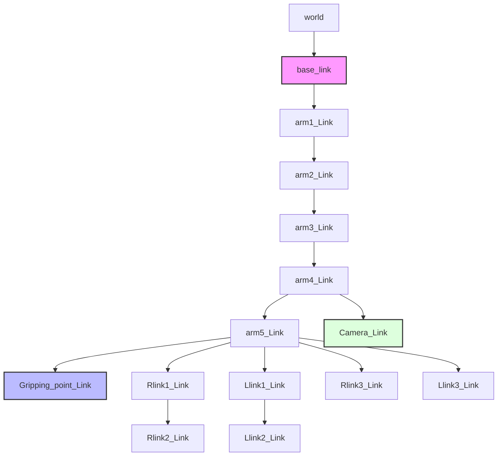

# 02. Mô Hình Động Học & Cấu Trúc URDF/TF (Robot Kinematic Model & Frames)

Tài liệu này mô tả chi tiết mô hình toán học động học thuận/nghịch (Forward/Inverse Kinematics), cấu trúc mô tả robot thông qua file **URDF/Xacro**, định nghĩa các hệ quy chiếu (coordinate frames), bảng giới hạn khớp (joint limits) và cây biến đổi tọa độ **TF Tree** của robot Yahboom DOFBOT-SE.

---

## 1. Danh Mục File Mô Hình & Cấu Hình Liên Quan (Model & Config Files)

Toàn bộ các file định nghĩa mô hình cơ học và cấu hình MoveIt 2 của robot nằm trong các thư mục sau:

| Tên File | Đường dẫn trong Repository | Ý nghĩa chức năng |
| :--- | :--- | :--- |
| **`dofbot.urdf`** | `dofbot_robot_arm_6dof/src/dofbot_urdf/urdf/dofbot.urdf` | File mô tả cơ học chuẩn xuất từ SolidWorks (sw_urdf_exporter), chứa khối lượng, quán tính và liên kết lưới STL |
| **`dofbot.urdf.xacro`** | `dofbot_robot_arm_6dof/src/dofbot_moveit/config/dofbot.urdf.xacro` | File Xacro cấp cao nạp `dofbot.urdf` và tích hợp giao diện phần cứng `dofbot.ros2_control.xacro` |
| **`dofbot_lite_model.urdf.xacro`** | `dofbot_robot_arm_6dof/src/dofbot_moveit/config/dofbot_lite_model.urdf.xacro` | Bản mô hình rút gọn geometry phục vụ tính toán va chạm nhẹ trên RViz/MoveIt 2 |
| **`dofbot_fixed.urdf`** | `dofbot_robot_arm_6dof/src/dofbot_moveit/config/dofbot_fixed.urdf` | Mô hình khóa cứng khớp `arm5_Joint` tại $0\text{ rad}$ để cô lập 4-DOF giải vị trí độc lập |
| **`dofbot.srdf`** | `dofbot_robot_arm_6dof/src/dofbot_moveit/config/dofbot.srdf` | Semantic Robot Description: định nghĩa planning groups (`arm_group`, `grip_group`), named states và ma trận bỏ qua va chạm nội bộ |
| **`joint_limits.yaml`** | `dofbot_robot_arm_6dof/src/dofbot_moveit/config/joint_limits.yaml` | Giới hạn vận tốc, gia tốc thực tế của từng khớp trong MoveIt 2 (ghi đè giá trị placeholder 1000 rad/s của URDF) |
| **`kinematics.yaml`** | `dofbot_robot_arm_6dof/src/dofbot_moveit/config/kinematics.yaml` | Cấu hình plugin giải IK (KDLKinematicsPlugin, cấu hình `position_only_ik: true`) |

---

## 2. Bảng Định Nghĩa Links & Joints (Links & Joints Breakdown)

Cấu trúc chuỗi động học của DOFBOT-SE gồm **14 links** và **13 joints** (bao gồm cả các khâu cơ học phụ của cơ cấu kẹp song song).

### 2.1. Danh mục các Links

| Tên Link (URDF Link Name) | Khối lượng [kg] | Tâm khối lượng CoM $(X, Y, Z)\text{ [m]}$ | Ý nghĩa vật lý |
| :--- | :---: | :---: | :--- |
| **`base_link`** | $0.2071$ | $(-0.06717, -0.00068, 0.02356)$ | Khung đế kim loại cố định trên bàn |
| **`arm1_Link`** | $0.0255$ | $(0.00000, -0.00004, 0.01014)$ | Khâu quay đế theo phương đứng |
| **`arm2_Link`** | $0.0534$ | $(-0.00332, 0.00000, 0.03029)$ | Khâu vai nâng hạ cánh tay trên |
| **`arm3_Link`** | $0.0461$ | $(-0.00332, 0.00000, 0.03029)$ | Khâu khuỷu nâng hạ cẳng tay |
| **`arm4_Link`** | $0.0558$ | $(-0.00332, 0.00000, 0.03029)$ | Khâu cổ tay ngẩng, giá đỡ camera |
| **`arm5_Link`** | $0.0884$ | $(0.00000, 0.00000, 0.02000)$ | Khâu xoay kẹp và cụm động cơ gripper |
| **`Rlink1_Link`** | $0.0037$ | $(0.01500, 0.00000, 0.00000)$ | Khâu đòn kẹp chủ động bên phải |
| **`Rlink2_Link`** | $0.0021$ | $(0.01500, 0.00000, 0.00000)$ | Khâu đệm kẹp ngón phải |
| **`Rlink3_Link`** | $0.0021$ | $(0.01500, 0.00000, 0.00000)$ | Thanh giằng song song ngón phải |
| **`Llink1_Link`** | $0.0037$ | $(0.01500, 0.00000, 0.00000)$ | Khâu đòn kẹp chủ động bên trái |
| **`Llink2_Link`** | $0.0021$ | $(0.01500, 0.00000, 0.00000)$ | Khâu đệm kẹp ngón trái |
| **`Llink3_Link`** | $0.0021$ | $(0.01500, 0.00000, 0.00000)$ | Thanh giằng song song ngón trái |
| **`Camera_Link`** | $0.0200$ | $(0.00000, 0.00000, 0.00000)$ | Khung camera USB Sonix gắn trên khâu 4 |
| **`Gripping_point_Link`** | $0.0001$ | $(0.00000, 0.00000, 0.00000)$ | Điểm thao tác cuối ảo (TCP) giữa 2 mỏ kẹp |

### 2.2. Danh mục các Joints & Thông số Động học

| Tên Joint | Loại khớp | Khâu cha $\rightarrow$ Khâu con | Tọa độ gốc Origin $(X, Y, Z)\text{ [m]}$, $(R, P, Y)\text{ [rad]}$ | Trục xoay (Axis) | Giới hạn góc [rad] (deg) | Vận tốc giới hạn |
| :--- | :---: | :---: | :---: | :---: | :---: | :---: |
| **`arm1_Joint`** | revolute | `base_link` $\rightarrow$ `arm1_Link` | $(0, 0, 0.0925)$, $(0, 0, 0)$ | $(0, 0, 1)$ | $[-1.57, +1.57]$ ($-90^\circ \dots +90^\circ$) | $2.0\text{ rad/s}$ |
| **`arm2_Joint`** | revolute | `arm1_Link` $\rightarrow$ `arm2_Link` | $(0, 0.00005, 0.033)$, $(0, 0, 0)$ | $(0, 1, 0)$ | $[-1.57, +1.57]$ ($-90^\circ \dots +90^\circ$) | $2.0\text{ rad/s}$ |
| **`arm3_Joint`** | revolute | `arm2_Link` $\rightarrow$ `arm3_Link` | $(0, 0.00055, 0.08285)$, $(0, 0, 0)$ | $(0, 1, 0)$ | $[-1.57, +1.57]$ ($-90^\circ \dots +90^\circ$) | $2.0\text{ rad/s}$ |
| **`arm4_Joint`** | revolute | `arm3_Link` $\rightarrow$ `arm4_Link` | $(0, 0.00005, 0.08285)$, $(0, 0, 0)$ | $(0, 1, 0)$ | $[-1.57, +1.57]$ ($-90^\circ \dots +90^\circ$) | $2.0\text{ rad/s}$ |
| **`arm5_Joint`** | revolute | `arm4_Link` $\rightarrow$ `arm5_Link` | $(-0.00215, -0.000045, 0.07815)$, $(0, 0, 0)$ | $(0, 0, 1)$ | $[-1.57, +1.57]$ ($-90^\circ \dots +90^\circ$) | $2.0\text{ rad/s}$ |
| **`Gripping_Joint`**| **fixed** | `arm5_Link` $\rightarrow$ `Gripping_point_Link` | $(-0.00265, 0.000098, 0.06809)$, $(\pi, -\frac{\pi}{2}, 0)$ | Không | Cố định (Virtual TCP) | Không |
| **`Camera_Joint`** | **fixed** | `arm4_Link` $\rightarrow$ `Camera_Link` | $(-0.0481, -0.00005, 0.0707)$, $(0, 0, 0)$ | Không | Cố định (Eye-in-Hand) | Không |
| **`Rlink1_Joint`** | revolute | `arm5_Link` $\rightarrow$ `Rlink1_Link` | $(-0.00575, -0.012625, 0.029275)$, $(\frac{\pi}{2}, 0.0119, -\frac{\pi}{2})$ | $(0, 0, 1)$ | $[0.0, +1.57]$ ($0^\circ \dots 90^\circ$) | $2.0\text{ rad/s}$ |
| **`Llink1_Joint`** | revolute | `arm5_Link` $\rightarrow$ `Llink1_Link` | $(-0.00575, 0.012375, 0.029275)$, $(-\frac{\pi}{2}, 0.0128, \frac{\pi}{2})$ | $(0, 0, 1)$ | $[-1.57, +1.57]$ | $2.0\text{ rad/s}$ |
| **`Rlink2_Joint`** | continuous| `Rlink1_Link` $\rightarrow$ `Rlink2_Link` | $(0.03, 0, 0)$, $(0, 0, 1.5827)$ | $(0, 0, 1)$ | Liên tục (Khớp bị dẫn) | Không |
| **`Llink2_Joint`** | continuous| `Llink1_Link` $\rightarrow$ `Llink2_Link` | $(0.03, 0, 0)$, $(0, 0, -1.5836)$ | $(0, 0, 1)$ | Liên tục (Khớp bị dẫn) | Không |
| **`Rlink3_Joint`** | continuous| `arm5_Link` $\rightarrow$ `Rlink3_Link` | $(-0.0055, -0.0045, 0.047275)$, $(\frac{\pi}{2}, 0.0027, -\frac{\pi}{2})$ | $(0, 0, 1)$ | Liên tục (Thanh giằng) | Không |
| **`Llink3_Joint`** | continuous| `arm5_Link` $\rightarrow$ `Llink3_Link` | $(-0.0055, 0.0045, 0.047275)$, $(-\frac{\pi}{2}, 0, \frac{\pi}{2})$ | $(0, 0, 1)$ | Liên tục (Thanh giằng) | Không |

---

## 3. Hệ Quy Chiếu Cốt Lõi (Core Reference Frames)

Trong hệ thống điều khiển DOFBOT-SE, 4 hệ quy chiếu đóng vai trò quyết định:

```mermaid
flowchart TD
    W["world (Gốc không gian làm việc bàn)"] -->|virtual_joint (fixed)| B["base_link (Tâm đế robot, Z=0)"]
    B -->|arm1..arm4| A4["arm4_Link (Cổ tay ngẩng)"]
    A4 -->|Camera_Joint (fixed offset)| C["Camera_Link (Tọa độ camera quang học)"]
    A4 -->|arm5_Joint| A5["arm5_Link (Đế xoay kẹp)"]
    A5 -->|Gripping_Joint (fixed RPY: pi, -pi/2, 0)| T["Gripping_point_Link (TCP Tâm gắp thực tế)"]
    A5 -->|Rlink1 / Llink1| G["Parallel Gripper Fingers"]
```

1. **`base_link` (Base Frame):**
   * Tọa độ gốc cơ học của robot, nằm ở mặt phẳng đáy kim loại tiếp xúc với mặt bàn.
   * Chiều trục: Trục $+Z$ hướng thẳng đứng lên trời; trục $+X$ hướng thẳng ra phía trước robot (theo quy ước ROS); trục $+Y$ hướng sang bên trái tạo thành tam diện thuận.
   * *Lưu ý kỹ thuật đặc biệt*: Trong mô hình URDF gốc của Yahboom, toàn bộ vùng thao tác gắp của bàn cờ / khay màu phía trước robot lại có tọa độ mang dấu âm theo trục $X$ ($X \in [-0.10, -0.28]\text{ m}$), đây là nguồn gốc gây ra lỗi đảo dấu không gian nếu lập trình viên mặc định trục $X$ dương.

2. **`Gripping_point_Link` (End-Effector / TCP Frame):**
   * Điểm trung tâm ảo giữa hai mỏ kẹp silicon, là điểm mục tiêu cần điều khiển vị trí trong bài toán IK.
   * Nằm cách khâu `arm5_Link` một khoảng tịnh tiến $Z = 0.06809\text{ m}$ ($68.1\text{ mm}$).
   * Hướng ma trận xoay: Gốc xoay danh định $(\text{Roll}=\pi, \text{Pitch}=-\pi/2, \text{Yaw}=0)$. Khi kẹp chúc thẳng đứng xuống mặt bàn, trục hướng kẹp dọc theo phương trọng trường.

3. **`Camera_Link` (Camera Frame):**
   * Gắn cố định trên khâu `arm4_Link` thông qua giá nhựa đỡ camera.
   * Vector tịnh tiến tương đối so với khớp cổ tay: $(\Delta X = -48.1\text{ mm}, \Delta Y = -0.05\text{ mm}, \Delta Z = 70.7\text{ mm})$.
   * Vì camera gắn trên khâu 4 (trước khớp xoay khâu 5), hình ảnh thu được từ camera không bị xoay tròn khi khâu kẹp (khâu 5) xoay góc định hướng vật thể.

4. **`world` (World Planning Frame):**
   * Khung tọa độ cố định gắn với môi trường thế giới thực.
   * Liên kết với `base_link` qua khớp ảo cố định: `<virtual_joint name="virtual_joint" type="fixed" parent_frame="world" child_link="base_link"/>`.

---

## 4. Cây Biến Đổi Tọa Độ Không Gian (TF Tree Topology)

Cây TF trích xuất từ trạng thái thực tế hệ thống (`frames_2026-09-22_13.33.51.gv`):



---

## 5. Đặc Thù Cấu Trúc Động Học 5-DOF (Kinematic Degeneracy & Position-Only IK)

Cánh tay robot DOFBOT-SE gồm 5 khớp nối tiếp (`arm1_Joint` $\dots$ `arm5_Joint`), trong đó:
* Khớp 1 ($Z$): Điều khiển góc phương vị (Yaw của toàn bộ thân tay).
* Khớp 2, 3, 4 ($Y$, $Y$, $Y$): Ba trục xoay hoàn toàn song song với nhau, cùng nằm trong mặt phẳng đứng tạo thành chuỗi phẳng 3 khâu (planar 3R manipulator). Chuỗi này quyết định tầm vươn $(R, Z)$ và góc chúc ngẩng (Pitch) của khâu thao tác cuối.
* Khớp 5 ($Z$ cục bộ): Điều khiển góc xoay Roll/Yaw quanh trục kẹp.

### Hệ quả kỹ thuật đối với giải thuật IK:
1. **Thiếu một bậc tự do định hướng tự do (Underactuated in 6D Pose):** Một tay máy cần tối thiểu 6 khớp độc lập để có thể đạt tới tọa độ $(X, Y, Z)$ với bất kỳ bộ 3 góc Euler $(\text{Roll}, \text{Pitch}, \text{Yaw})$ tùy ý. Với 5 bậc tự do, DOFBOT-SE chỉ có thể thỏa mãn 5 ràng buộc đồng thời. Nếu ép một bộ giải 6D IK giải đầy đủ cả vị trí và góc hướng, hệ thống sẽ rơi vào trạng thái quá ràng buộc (overconstrained), dẫn tới không tìm thấy nghiệm khả thi.
2. **Giải pháp chuẩn hóa (Position-Only IK & Relaxed Orientation):**
   * Trong cấu hình MoveIt 2 (`kinematics.yaml`), đặt thông số:
     ```yaml
     arm_group:
       kinematics_solver: kdl_kinematics_plugin/KDLKinematicsPlugin
       kinematics_solver_search_resolution: 0.005
       kinematics_solver_timeout: 0.05
       position_only_ik: true
     ```
   * Khi đó, thuật toán IK chỉ bắt buộc thỏa mãn tọa độ vị trí 3D $(X, Y, Z)$ tại `Gripping_point_Link`. Góc chúc ngẩng (Pitch) được tự do lựa chọn theo tư thế tối ưu nhất của chuỗi phẳng, và khớp 5 được giải độc lập để căn chỉnh song song với góc xoay của vật thể trên mặt bàn.
