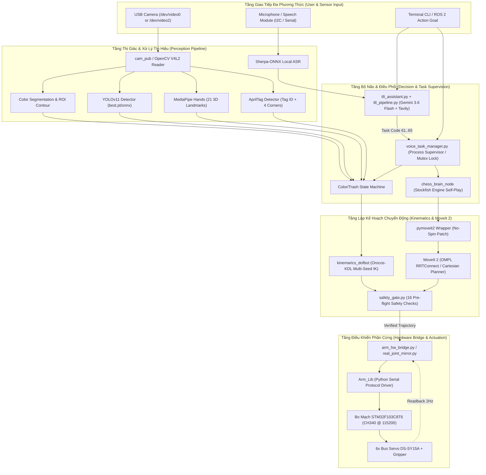

# 03. Kiến Trúc Hệ Thống & Cấu Trúc Repository (System Architecture & Package Breakdown)

Tài liệu này trình bày tổng quan cấu trúc mã nguồn, cây phân cấp thư mục của toàn bộ kho lưu trữ (`repository tree`), phân tích chuyên sâu chức năng từng gói phần mềm (ROS 2 packages) và mối quan hệ tương tác giữa các phân hệ: **Camera**, **Perception**, **Motion Planning (MoveIt 2)**, **Robot Driver**, **Manipulation**, và **Task Orchestration / Supervision**.

---

## 1. Sơ Đồ Cấu Trúc Tổng Thể Hệ Thống (End-to-End System Architecture)

Hệ thống điều khiển DOFBOT-SE được thiết kế theo mô hình kiến trúc phân lớp hướng module (Modular Layered Architecture), đảm bảo tính an toàn cơ học và tính độc lập giữa các tầng xử lý:



---

## 2. Bố Cục Kho Lưu Trữ (Repository Tree Overview)

Do tiến trình nghiên cứu kế thừa từ bản gốc Yahboom và được tái cấu trúc (refactor) lên ROS 2 hiện đại, mã nguồn được phân bổ trong các không gian làm việc (workspaces) chuyên biệt:

```text
/home/jloy/Desktop/robot-arm/
├── 2.About_Hardware-.../       # Tài liệu datasheet gốc: Bus servo, STM32, CAD STEP
├── Dofbot/                     # Các notebook Jupyter mẫu của hãng Yahboom (Python 3)
├── colcon_ws/                  # Gói phần mềm ROS / Python thuật toán gốc (CV core)
│   └── src/
│       ├── dofbot_color_sorting/     # Phân loại màu cố định (T1)
│       ├── dofbot_color_grab/        # Gắp khối màu cơ bản (T2)
│       ├── dofbot_color_stacking/    # Xếp chồng khối màu theo tầng (T2)
│       ├── dofbot_color_follow/      # Bám tâm khối màu Pan/Tilt (T3)
│       ├── dofbot_face_follow/       # Bám khuôn mặt (T3)
│       ├── dofbot_apriltag/          # Nhận diện AprilTag (T5)
│       ├── dofbot_garbage_yolov11/   # Phân loại rác YOLOv11 (T6)
│       ├── dofbot_gesture/           # Cử chỉ tay MediaPipe (T4)
│       └── dofbot_utils/             # Thư viện tiện ích xử lý ảnh / PID
├── dofbot_ws/                  # Gói phần mềm ROS 2 lõi (đã tái cấu trúc KDL Kinematics)
│   └── src/
│       ├── dofbot_info/              # Node giải động học KDL (kinemarics_dofbot)
│       ├── dofbot_interface/         # Định nghĩa ROS 2 Service Kinemarics.srv
│       ├── dofbot_sorting_3d/        # Gắp thả màu theo tọa độ tự do (T-Dynamic)
│       ├── dofbot_follow/            # Thuật toán bám theo mục tiêu 2D
│       ├── dofbot_driver/            # Driver chuyển tiếp ROS sang Serial
│       └── dofbot_urdf/              # File URDF và lưới STL hình học
├── dofbot_robot_arm_6dof/      # Không gian làm việc MoveIt 2 & Hệ Thống An Toàn Độc Lập
│   ├── hardware/                     # SafetyGate, arm_hw_bridge, mirror, calibration
│   └── src/
│       ├── dofbot_moveit/            # Cấu hình MoveIt 2, controllers, OMPL, SRDF
│       ├── dofbot_common/            # Single Source of Truth (hằng số, topics, frames)
│       ├── chess_moveit_demo/        # Đánh cờ vua MoveIt 2 tự động (Stockfish)
│       ├── dofbot_tea_moveit/        # Trình diễn rót trà bằng MoveIt C++
│       ├── cap_vision/               # Pipeline hiệu chuẩn camera, homography, ray-cast
│       ├── cap_grasp/                # Bộ lập kế hoạch gắp nắp/khối
│       ├── cap_scene_interfaces/     # Interface tin nhắn ROS SceneObject
│       └── pymoveit2/                # Wrapper Python điều khiển MoveIt 2
├── dofbot_voice/               # Tầng tương tác giọng nói cục bộ (T7 Bring-up & Shim)
│   └── scripts/                      # Speech_Lib shim, smbus wrap, voice sorting/stack
├── LargeModel_ws/              # Tầng điều phối mô hình ngôn ngữ lớn hiện đại (T8 LLM)
│   ├── t8_assistant.py               # Node trợ lý chính (CLI / Mic / Vision)
│   ├── t8_pipeline.py                # Lõi Gemini 3.6 Flash + Tavily Search
│   ├── stub_planner.py               # Bộ lập kế hoạch kiểm thử offline (Mock Planner)
│   └── task_ontology.yaml            # Danh mục hành vi hợp lệ (Whitelist)
├── docs/                       # Tài liệu thiết kế, runbook và bài báo
│   ├── basic_arm_runbook.md          # Hướng dẫn vận hành tay thật an toàn
│   ├── project_architecture_and_refactor_summary.md # Tổng kết tái cấu trúc
│   ├── yahboom_task_test_plan.md     # Kế hoạch kiểm thử tác vụ
│   └── paper/                        # 8 file tài liệu chuyên sâu phục vụ viết bài báo
└── log/                        # Nhật ký thực nghiệm thực tế và ảnh chụp hiện trường
```

---

## 3. Phân Tích Chức Năng Chi Tiết Từng Phân Hệ (Module Breakdown)

### 3.1. Phân hệ Cảm Biến & Đọc Camera (`camera`)
* **Vai trò:** Quản lý giao tiếp cấp thấp với cảm biến ảnh UVC, giải phóng xung đột tài nguyên giữa camera tích hợp của laptop và camera robot, cung cấp khung hình sạch cho các bộ nhận diện.
* **Gói & File chủ đạo:**
  * `dofbot_sorting_3d/scripts/cam_pub.py`: Node ROS 2 độc lập đọc luồng V4L2 từ camera robot Sonix, đóng gói thô sang `sensor_msgs/msg/Image` định dạng `rgb8` ở tần số $10\text{ Hz}$, loại bỏ hoàn toàn `cv_bridge` nhằm triệt tiêu lỗi sập trên NumPy 2.x.
  * `cap_vision/camera_test.py`: Công cụ kiểm tra độ nét và thông số phơi sáng của camera.
  * Cổng thiết bị chuẩn: `/dev/video0` hoặc `/dev/video2` (Sonix USB 2.0, phân biệt với webcam laptop qua `/dev/v4l/by-id/`).

### 3.2. Phân hệ Thị Giác & Trích Xuất Đặc Trưng (`perception`)
* **Vai trò:** Biến đổi dữ liệu điểm ảnh thô (pixel space) thành thông tin ngữ nghĩa và tọa độ không gian (world coordinates).
* **Gói & File chủ đạo:**
  * **Xử lý màu (HSV):** `dofbot_color_sorting/color_sorting.py`, `dofbot_sorting_3d/color_sorting.py`, `cap_vision/red_scene_core.py`. Sử dụng không gian màu HSV với dải ngưỡng xác định trước, phép biến đổi hình thái học (morphological open/close) và tìm đường bao lớn nhất (`findContours`) lọc nhiễu diện tích ($S > 1000\text{ px}$).
  * **Nhận diện học sâu (YOLOv11):** `dofbot_yolov11/yolov11.py`, `dofbot_garbage_yolov11/garbage_identify.py`. Chạy mô hình suy luận `best.pt` / `best.onnx` phân loại rác thải thành 4 nhóm đối tượng.
  * **Nhận diện bàn tay (MediaPipe):** `dofbot_mediapipe/10_GestureRecognition.py`. Trích xuất 21 điểm mốc 3D của bàn tay, tính toán góc liên đốt ngón để phân loại cử chỉ điều khiển.
  * **Mã thị giác định vị (AprilTag / ArUco):** `dofbot_apriltag/apriltag_identify.py`. Trích xuất góc nghiêng (Yaw) và tâm tag để định hướng mỏ kẹp.
  * **Bộ chuyển đổi Tọa độ (Pixel-to-World):** `cap_vision/calibrate_table.py` và `test_pixel_to_xy.py`. Chuyển đổi điểm ảnh sang mét thông qua ma trận Homography hoặc thuật toán bắn tia giao mặt phẳng (Ray-plane intersection).

### 3.3. Phân hệ Quy Hoạch Chuyển Động (`moveit`)
* **Vai trò:** Tính toán quỹ đạo không gian khớp và không gian Đề-các (Cartesian) tránh va chạm với chướng ngại vật trong môi trường (bàn làm việc, bàn cờ).
* **Gói & File chủ đạo:**
  * `dofbot_moveit`: Chứa toàn bộ cấu hình SRDF (`dofbot.srdf`), ma trận tự va chạm, file tham số OMPL (`ompl_planning.yaml`) và giới hạn động học (`joint_limits.yaml`).
  * `pymoveit2`: Lớp vỏ bọc (wrapper) bằng Python tương thích MoveIt 2, được vá lỗi không khóa luồng xoay (no-spin patch), hỗ trợ gọi lập quỹ đạo điểm-đến-điểm và quỹ đạo nội suy thẳng Cartesian (`compute_cartesian_path`).
  * `chess_moveit_demo/pick_place_node.py`: Dựng mô hình không gian quy hoạch gồm 33 đối tượng va chạm (mặt bàn, bàn cờ, 32 quân cờ) và thực thi chuỗi hành vi gắp-nhấc-chuyển-hạ-thả.

### 3.4. Phân hệ Giao Tiếp Phần Cứng & An Toàn (`robot_driver` & `hardware`)
* **Vai trò:** Cầu nối giữa lệnh quỹ đạo cấp cao và động cơ vật lý, đảm bảo an toàn tuyệt đối trước khi truyền xung lệnh tới servo.
* **Gói & File chủ đạo:**
  * `hardware/safety_gate.py`: Module kiểm soát an toàn nghiêm ngặt thực thi **16 bước kiểm tra (16 Pre-flight Safety Checks)**: kiểm tra giới hạn khớp URDF, giới hạn góc servo, trần vận tốc ($2.0\text{ rad/s} \times \text{scale} \le 0.5\text{ rad/s}$), độ nhảy bước đột ngột giữa 2 waypoint ($\Delta q \le 0.6\text{ rad}$), độ khớp của tư thế ban đầu ($\le 0.05\text{ rad}$) và độ tươi của dữ liệu cảm biến ($< 1.0\text{ s}$).
  * `hardware/arm_hw_bridge.py`: Bộ điều khiển thực thi quỹ đạo trên phần cứng. Đọc phản hồi thực tế từ servo qua STM32, gửi từng điểm lệnh với thời gian nội suy mịn (`time_ms`), tự động ngắt khẩn cấp (E-Stop) nếu sai số bám quỹ đạo vượt quá ngưỡng $0.15\text{ rad}$.
  * `hardware/real_joint_mirror.py`: Trực quan hóa một chiều bóng dáng tay thật lên RViz thông qua topic `/real_joint_states` với tiền tố `real_`, giúp người vận hành quan sát độ lệch giữa mô phỏng và thực tế.
  * `dofbot_driver/dofbot_driver.py`: Driver gốc của hãng (đã được thay thế bằng bridge an toàn do lỗi forward mù quáng trạng thái mô phỏng ra robot thật).

### 3.5. Phân hệ Thao Tác Cơ Học & Động Học (`manipulation` & `kinematics`)
* **Vai trò:** Cung cấp dịch vụ giải bài toán động học thuận (FK) và động học nghịch (IK) cho chuỗi động học 5-DOF.
* **Gói & File chủ đạo:**
  * `dofbot_info/src/dofbot_kinematics.cpp`: Bản tái xây dựng hoàn toàn bằng thư viện mã nguồn mở **Orocos-KDL**. Tích hợp bộ giải đệ quy Newton-Raphson có giới hạn khớp (`ChainIkSolverPos_NR_JL`) với **chiến lược Multi-seed (13 tư thế mồi)** và **giải thuật dự phòng ngẫu nhiên (Position-First Random Restart 200x40)**, triệt tiêu hoàn toàn hiện tượng kẹt điểm kỳ dị Gimbal Lock khi kẹp chúc vuông góc với bàn.
  * `dofbot_interface`: Gói định nghĩa giao tiếp dịch vụ ROS 2 `dofbot_interface/srv/Kinemarics.srv` tiếp nhận tọa độ $(X, Y, Z, \text{Roll}, \text{Pitch}, \text{Yaw})$ và trả về 5 góc khớp.

### 3.6. Phân hệ Điều Phối Tác Vụ & Trợ Lý Đa Phương Thức (`task` & `supervisor`)
* **Vai trò:** Tiếp nhận ngôn ngữ tự nhiên, phân tích chủ đích người dùng, giám sát độc quyền tài nguyên phần cứng và điều phối các kịch bản hành vi phức tạp.
* **Gói & File chủ đạo:**
  * `dofbot_voice/scripts/voice_task_manager.py`: Bộ giám sát tiến trình độc quyền (Process Supervisor) dựa trên cơ chế khóa tệp `/tmp/dofbot_task_manager.lock`. Ngăn chặn triệt để tình trạng hai tiến trình cùng mở cổng `/dev/ttyUSB0` hoặc `/dev/video0`. Quản lý vòng đời (spawn, monitor, kill process group) của các tác vụ ROS con.
  * `LargeModel_ws/t8_assistant.py` & `t8_pipeline.py`: Trợ lý AI thế hệ mới kết hợp mô hình thị giác-ngôn ngữ **Gemini 3.6 Flash** và công cụ tìm kiếm thời gian thực **Tavily Search API**. Ràng buộc đầu ra theo ontology nghiêm ngặt (chỉ cho phép các action: `none`, `color`, `stack`, `face`, `trash`, `stop`), tuyệt đối cấm mô hình tự ý sinh lệnh hệ thống hay góc servo nguy hiểm.
  * `dofbot_voice/scripts/Speech_Lib.py`: Lớp giao tiếp trung gian (shim layer) mô phỏng giọng nói, cho phép kiểm thử logic tự động bằng cách tiêm mã lệnh giả lập mà không phụ thuộc vào microphone phần cứng.
