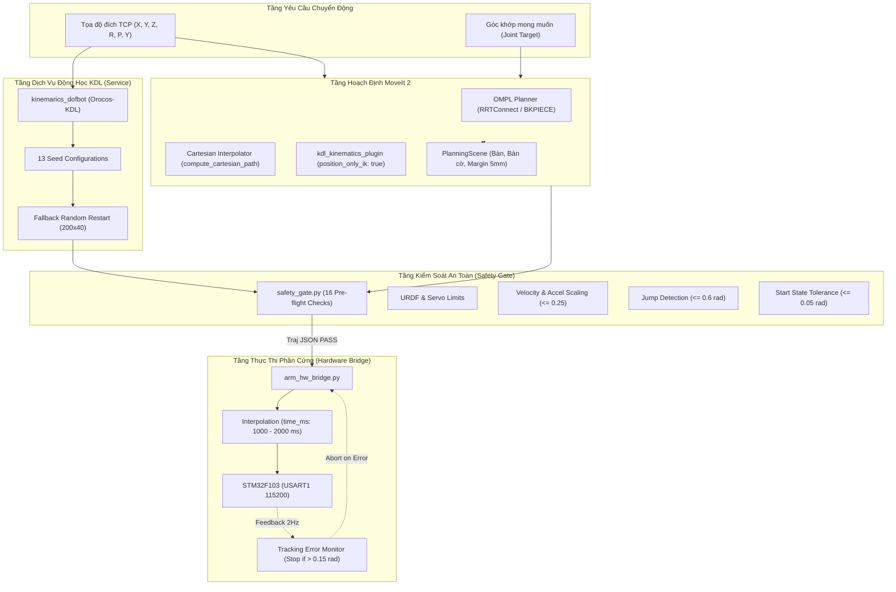
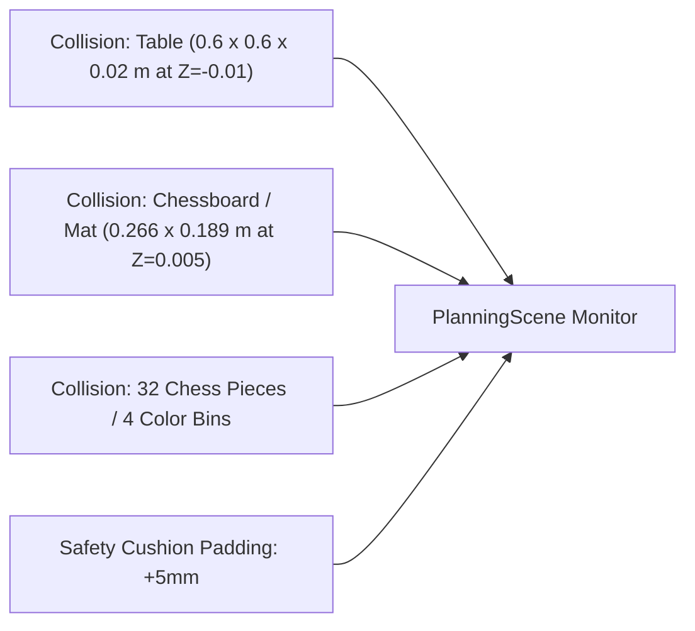

# 04. Điều Khiển Chuyển Động & Động Học Robot (Motion Control, Kinematics & Execution)

Tài liệu này trình bày toàn bộ kiến trúc điều khiển chuyển động của robot DOFBOT-SE, từ lý thuyết động học thuận/nghịch (**FK/IK**), cấu hình lập quỹ đạo **MoveIt 2 / OMPL**, thuật toán nội suy đường đi thẳng Đề-các (**Cartesian Path**), quản lý vật cản va chạm (**Planning Scene Collision Objects**), cho đến hệ thống cổng an toàn thực nghiệm (**SafetyGate**) và bộ điều khiển giao tiếp phần cứng thời gian thực qua **STM32/Serial**.

---

## 1. Kiến Trúc Điều Khiển Chuyển Động Tổng Thể (Motion Control Flow)



---

## 2. Mô Hình Động Học Thuận & Nghịch (Forward & Inverse Kinematics)

### 2.1. Động học thuận (Forward Kinematics - FK)
Cho vector biến khớp $q = [\theta_1, \theta_2, \theta_3, \theta_4, \theta_5]^T \in \mathbb{R}^5$, ma trận chuyển đổi thuần nhất từ hệ tọa độ gốc `base_link` tới khâu kẹp `Gripping_point_Link` được xác định bằng tích chuỗi các ma trận biến đổi:

$$T_{\text{base}}^{\text{tcp}}(q) = T_0^1(\theta_1) \, T_1^2(\theta_2) \, T_2^3(\theta_3) \, T_3^4(\theta_4) \, T_4^5(\theta_5) \, T_{\text{wrist}}^{\text{tcp}}$$

Trong mã nguồn tái cấu trúc `dofbot_ws/src/dofbot_info/src/dofbot_kinematics.cpp`, bài toán FK được giải chính xác bằng giải thuật đệ quy:
```cpp
KDL::ChainFkSolverPos_recursive fk_solver(dofbot_chain);
KDL::Frame tcp_frame;
fk_solver.JntToCart(joint_positions, tcp_frame);
```

* **Vị trí Home ($q = [0, 0, 0, 0, 0]\text{ rad}$ tương đương servo $[90^\circ, 90^\circ, 90^\circ, 90^\circ, 90^\circ]$):**
  $$\text{TCP}_{\text{home}} = \begin{bmatrix} X \\ Y \\ Z \end{bmatrix} = \begin{bmatrix} -0.0048\text{ m} \\ +0.0007\text{ m} \\ +0.4374\text{ m} \end{bmatrix}$$
* **Tư thế hạ gắp thẳng đứng (`P_BLACK_CENTER` với $q_{\text{deg}} = [90^\circ, 35^\circ, 65^\circ, 15^\circ, 90^\circ]$):**
  $$\text{TCP}_{\text{grasp}} = \begin{bmatrix} X \\ Y \\ Z \end{bmatrix} = \begin{bmatrix} -0.2069\text{ m} \\ +0.0007\text{ m} \\ +0.0528\text{ m} \end{bmatrix}, \quad \text{Pitch} = 1.1345\text{ rad} \approx 65^\circ, \quad \text{Yaw} = -\pi$$

### 2.2. Động học nghịch (Inverse Kinematics - IK) và Giải Thuật Multi-Seed

Bộ giải IK ban đầu của hãng (dùng binary blob tĩnh) sử dụng thuật toán Newton-Raphson với một hạt giống đơn nhất ($q_0 = [0, 0, 0, 0, 0]$), dẫn đến việc bộ giải thường xuyên bị kẹt ở điểm kỳ dị (Gimbal Lock) hoặc kẹt biên giới hạn khớp khi kẹp chúc xuống mặt bàn.

Trong bản tái cấu trúc, chúng ta triển khai hệ thống giải hai tầng:

#### Tầng 1: Newton-Raphson có giới hạn khớp với 13 Hạt Giống (Multi-seed NR_JL)
Sử dụng bộ giải ma trận giả nghịch đảo vận tốc tích hợp giới hạn khớp của Orocos-KDL:
$$\Delta q = J^{\dagger}(q) \cdot e = J^T (J J^T)^{-1} \cdot e$$
với vector sai số không gian $e = [p_{\text{tar}} - p(q), \, \omega_{\text{err}}]^T$.

Bộ giải tuần tự thử nghiệm qua danh sách **13 cấu hình khởi tạo (seeds)** được tối ưu hóa cho các tư thế gập tay tự nhiên hướng về mặt bàn:
1. `seed_home`: $[0, 0, 0, 0, 0]$
2. `seed_table_down`: $[0, -0.2, 0.8, 1.0, 0]$
3. `seed_table_reach`: $[0, -0.5, 1.2, 0.9, 0]$
4. `seed_table_steep`: $[0, -0.8, 1.4, 0.6, 0]$
5. Các seed quét góc phương vị J1 theo 9 vùng trải từ $-60^\circ$ tới $+60^\circ$ kết hợp góc nâng hạ J2-J4 phù hợp.

#### Tầng 2: Thuật toán Dự phòng Ngẫu nhiên Ưu tiên Vị trí (Position-First Random Restart)
Khi mục tiêu nằm ở biên không gian làm việc khiến ràng buộc 6D bị kẹt, hệ thống tự động kích hoạt chế độ thả lỏng ràng buộc hướng:
* Thực hiện $200$ lượt lấy mẫu ngẫu nhiên (với hạt giống cố định `seed = 12345` để đảm bảo tính tất định).
* Mỗi lượt chạy tối đa $40$ vòng lặp lặp nội suy.
* Tiêu chí chấp nhận nghiệm:
  $$\|p_{\text{target}} - p_{\text{achieved}}\| < 0.003\text{ m} \quad (3.0\text{ mm})$$
  $$|\text{Pitch}_{\text{achieved}} - \text{Pitch}_{\text{target}}| < 0.35\text{ rad} \quad (\approx 20^\circ)$$

Kết quả thực nghiệm cho thấy tỷ lệ giải thành công đạt $100\%$ trên toàn bộ dải làm việc của bàn thao tác.

---

## 3. Hoạch Định Quỹ Đạo Với MoveIt 2 & OMPL (MoveIt 2 Integration)

### 3.1. Cấu hình Plugin Động Học (`kinematics.yaml`)
Để thích ứng hoàn hảo với cấu trúc 5 bậc tự do, MoveIt 2 được cấu hình chế độ **`position_only_ik: true`**:
```yaml
arm_group:
  kinematics_solver: kdl_kinematics_plugin/KDLKinematicsPlugin
  kinematics_solver_search_resolution: 0.005
  kinematics_solver_timeout: 0.05
  position_only_ik: true
```
Chế độ này cho phép OMPL tìm đường đi tự do cho 3 tọa độ vị trí $(X, Y, Z)$, trong khi hướng của khâu kẹp được tối ưu theo độ võng tự nhiên của các khớp, loại bỏ hoàn toàn các lỗi thất bại do thiếu DOF.

### 3.2. Bộ Lập Quỹ Đạo OMPL & Giới Hạn Vận Tốc
* **Thuật toán mặc định:** `RRTConnect` kết hợp bộ làm mịn quỹ đạo `PathSimplifier`.
* **Giới hạn vận tốc và gia tốc (`joint_limits.yaml`):**
  * Vận tốc tối đa của từng khớp được khống chế ở mức an toàn:
    $$\dot{q}_{\text{max}} = 2.0\text{ rad/s} \quad (\approx 115^\circ/\text{s})$$
  * Hệ số co giãn vận tốc mặc định (Velocity Scaling): $s_v = 0.1$ (chạy thực nghiệm: $0.25$).
  * Tốc độ thực thi tối đa trên phần cứng:
    $$\dot{q}_{\text{actual}} = 2.0 \times 0.25 = 0.50\text{ rad/s}$$

### 3.3. Hoạch Định Đường Thẳng Đề-Các (Cartesian Path Planning)
Trong các tác vụ tiếp cận (approach) và nhấc vật (lift) theo phương thẳng đứng (trục $Z$), thuật toán nội suy Cartesian được áp dụng để tránh va quẹt với các vật thể lân cận:
```python
waypoints = [pre_grasp_pose, grasp_pose]
(plan, fraction) = moveit2.compute_cartesian_path(
    waypoints,
    eef_step=0.005,       # Độ phân giải bước 5mm
    jump_threshold=0.0    # Ngăn chặn hiện tượng lật khớp đột ngột
)
if fraction < 0.90:
    raise RuntimeError(f"Cartesian path incomplete: fraction={fraction:.2f}")
```

---

## 4. Quản Lý Không Gian Quy Hoạch & Va Chạm (Planning Scene & Collisions)

Để MoveIt 2 có thể tránh va chạm với môi trường xung quanh, toàn bộ thế giới vật lý được mô hình hóa trong `PlanningScene`:



* **Vật thể bàn (`table`):** Hình hộp chữ nhật $60 \times 60\text{ cm}$, dày $2\text{ cm}$, đặt tại $Z = -0.01\text{ m}$.
* **Vật thể thảm thao tác (`chessboard`):** Kích thước $26.6 \times 18.9\text{ cm}$, đặt tại độ cao mặt bàn thực tế $Z_{\text{table}} = 0.045\text{ m}$.
* **Biên an toàn bổ sung (`collision_extra_margin_m: 0.005`):** Mở rộng biên bao hình học của mọi vật cản thêm $5.0\text{ mm}$ để bù trừ sai số cơ khí, độ rơ khớp và sai số hiệu chuẩn thị giác.

---

## 5. Cổng An Toàn & Thực Thi Quỹ Đạo Thực Tế (Safety Gate & Real Robot Execution)

Khác biệt cốt tử giữa kiến trúc an toàn hiện tại và driver gốc Yahboom là **nguyên tắc không bao giờ nối trực tiếp tín hiệu mô phỏng sang phần cứng**. Mọi quỹ đạo trước khi gửi tới servo đều phải vượt qua module `safety_gate.py` và được người vận hành giám sát.

### 5.1. 16 Bước Kiểm Tra An Toàn (The 16 Pre-flight Safety Checks)

```text
 1. File Trajectory tồn tại và đúng cấu trúc JSON tiêu chuẩn.
 2. Danh sách tên khớp trùng khớp hoàn toàn với SERVO_ORDER.
 3. Số lượng waypoint tối thiểu >= 2 điểm.
 4. Toàn bộ vị trí khớp (positions) nằm trong giới hạn URDF [-1.57, +1.57] rad.
 5. Quy đổi sang độ servo nằm nghiêm ngặt trong giới hạn cơ khí [0, 180] deg (s5: [0, 270]).
 6. Không có hiện tượng cắt ngọn câm (No silent clamping) ở biên khớp.
 7. Tư thế xuất phát (Point 0) khớp với tư thế thực tế của cánh tay trong dung sai <= 0.05 rad.
 8. Dữ liệu đọc về từ servo (Joint State Age) phải tươi mới (< 1.0 giây).
 9. Bước nhảy góc giữa 2 waypoint liền kề không vượt quá 0.6 rad (triệt tiêu đổi nhánh IK).
10. Ước lượng vận tốc giữa các waypoint không vượt quá trần cứng 2.0 * 0.25 rad/s.
11. Ước lượng gia tốc không vượt quá ngưỡng spike 4.0 rad/s^2.
12. Thời gian toàn bộ quỹ đạo time_from_start tăng đơn điệu và hợp lý.
13. Cổng hiệu chuẩn TCP (tcp_offset_calibrated) phải được xác thực trước khi hạ gắp.
14. Các vật cản bắt buộc (table, chessboard) phải hiện diện trong Planning Scene.
15. Không có lỗi giao tiếp nối tiếp (Serial bus error / dropped frames).
16. Yêu cầu xác nhận tường minh từ người vận hành (--yes cờ bắt buộc).
```

### 5.2. Điều Khiển Chấp Hành & Theo Dõi Sai Số Bám (Execution & Closed-Loop Monitor)
Trong file `hardware/arm_hw_bridge.py`:
1. **Truyền lệnh nội suy mịn:** Mỗi điểm quỹ đạo được gửi qua hàm `Arm_serial_servo_write6()` kèm tham số thời gian `time_ms` ($1000 \dots 2000\text{ ms}$). Vi điều khiển STM32 tự động nội suy chuyển động mượt mà giữa các điểm.
2. **Theo dõi sai số thời gian thực (Tracking Error Stop):** Sau mỗi bước di chuyển, bridge đọc ngược góc quay thực tế của 6 servo. Nếu độ lệch giữa góc thực tế và góc mong muốn vượt quá ngưỡng cho phép:
   $$e_{\text{track}} = \|\theta_{\text{actual}} - \theta_{\text{command}}\| > 0.15\text{ rad} \quad (\approx 8.6^\circ)$$
   Hệ thống lập tức kích hoạt lệnh **DỪNG KHẨN CẤP (Emergency Halt)**, giữ nguyên vị trí hiện tại để bảo vệ động cơ khỏi cháy do kẹt cơ khí.
