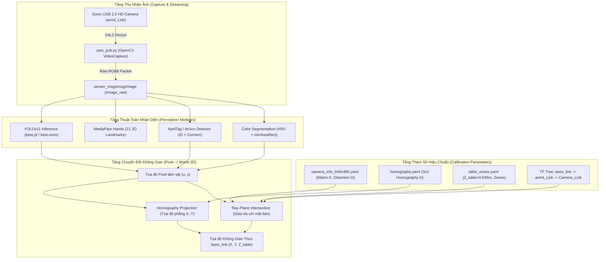

# 05. Thị Giác Máy Tính & Hiệu Chuẩn Không Gian (Vision Pipeline, Calibration & Coordinate Mapping)

Tài liệu này mô tả chi tiết toàn bộ chuỗi xử lý thị giác máy tính (Computer Vision Pipeline), các phương pháp hiệu chuẩn camera nội soi/ngoại quan (**Intrinsic & Extrinsic / Eye-in-Hand Calibration**), ma trận đồng điều mặt phẳng (**Homography Matrix**), thuật toán chuyển đổi tọa độ điểm ảnh sang không gian thực (**Pixel-to-World Mapping**), cùng các giải thuật nhận diện đối tượng (**HSV, AprilTag, MediaPipe, YOLOv11**) và nội dung các file cấu hình YAML liên quan.

---

## 1. Kiến Trúc Chuỗi Xử Lý Thị Giác (Vision Processing Pipeline)



---

## 2. Phần Cứng Camera & Bộ Thu Nhận Không Dùng `cv_bridge`

### 2.1. Nhận diện thiết bị và giải phóng xung đột V4L2
Hệ thống sử dụng camera USB Sonix (Microdia VID:PID `0c45:6340`). Trên máy trạm Linux có webcam tích hợp của laptop (ACER HD User Facing), số thứ tự thiết bị V4L2 có thể bị hoán đổi giữa các lần khởi động.
Quy tắc định tuyến thiết bị:
* Kiểm tra danh định phần cứng: `ls -l /dev/v4l/by-id/`
* Tránh mở nhầm webcam tích hợp bằng cách truyền cờ tường minh: `--camera /dev/video0` hoặc `/dev/video2`.

### 2.2. Tránh sập ứng dụng với NumPy 2.x
Thư viện ROS chuẩn `cv_bridge` phụ thuộc vào các phiên bản C-Python và NumPy cũ (NumPy 1.x). Khi triển khai trên môi trường Python 3.10+ với NumPy 2.2+, lệnh `bridge.cv2_to_imgmsg()` gây ra lỗi nghiêm trọng `KeyError 16`.
Để khắc phục triệt để, node `cam_pub.py` đóng gói frame ảnh thủ công:
```python
# Đóng gói dữ liệu ảnh thô RGB8 thẳng vào ROS Image Message:
msg = Image()
msg.header.stamp = self.get_clock().now().to_msg()
msg.header.frame_id = "Camera_Link"
msg.height = h
msg.width = w
msg.encoding = "rgb8"
msg.is_bigendian = 0
msg.step = w * 3
msg.data = cv2.cvtColor(bgr_frame, cv2.COLOR_BGR2RGB).tobytes()
self.publisher_.publish(msg)
```

---

## 3. Các Phương Pháp Hiệu Chuẩn (Calibration Methodologies)

### 3.1. Hiệu chuẩn nội suy Camera (Intrinsic Calibration)
File cấu hình: `dofbot_robot_arm_6dof/src/cap_vision/config/camera_info_640x480.yaml`.
* **Kích thước ảnh:** $W = 640\text{ px}$, $H = 480\text{ px}$.
* **Ma trận nội suy camera (Camera Matrix $K$):**
  $$K = \begin{bmatrix} f_x & 0 & c_x \\ 0 & f_y & c_y \\ 0 & 0 & 1 \end{bmatrix} = \begin{bmatrix} 902.0 & 0.0 & 320.0 \\ 0.0 & 875.4 & 240.0 \\ 0.0 & 0.0 & 1.0 \end{bmatrix}$$
  * Tiêu cự theo trục X: $f_x = 902.0\text{ px}$
  * Tiêu cự theo trục Y: $f_y = 875.4\text{ px}$
  * Tâm quang học (Principal Point): $(c_x, c_y) = (320.0, 240.0)\text{ px}$
* **Mô hình méo quang học (Distortion Model):** `plumb_bob` với 5 hệ số:
  $$D = [k_1, k_2, p_1, p_2, k_3] = [0.0, 0.0, 0.0, 0.0, 0.0]$$
  *(Được ước lượng qua FOV thực nghiệm $110 \times 85\text{ mm}$ tại khoảng cách $Z = 155\text{ mm}$)*.

### 3.2. Hiệu chuẩn Ngoại quan Cánh tay (Eye-in-Hand Extrinsic Calibration)
Camera được gắn trực tiếp trên khâu `arm4_Link` (ngay trước khớp xoay khâu 5).
* **Ma trận biến đổi tĩnh từ khớp cổ tay tới khung camera:**
  $$T_{\text{arm4}}^{\text{cam}} = \begin{bmatrix} 1 & 0 & 0 & -0.04810 \\ 0 & 1 & 0 & -0.00005 \\ 0 & 0 & 1 & +0.07070 \\ 0 & 0 & 0 & 1 \end{bmatrix}$$
* **Ưu điểm thiết kế:** Khi khâu kẹp (`arm5_Link`) xoay để điều chỉnh góc kẹp song song với vật thể, camera không bị xoay tròn theo, giúp quá trình theo dõi liên tục (continuous tracking) không bị mất dấu hình học.

### 3.3. Hiệu chuẩn Mặt phẳng Bàn (Table Plane Calibration & Homography)
File cấu hình: `dofbot_robot_arm_6dof/src/cap_vision/config/homography.yaml`.
Sử dụng tấm chuẩn kích thước A4 ($266\text{ mm} \times 189\text{ mm}$) đặt trên mặt bàn, trích xuất 4 điểm góc thực tế:
* $P_1 = (0.000, 0.000)\text{ m}$
* $P_2 = (0.266, 0.000)\text{ m}$
* $P_3 = (0.266, 0.189)\text{ m}$
* $P_4 = (0.000, 0.189)\text{ m}$

Ma trận Homography $3 \times 3$ ánh xạ trực tiếp từ điểm ảnh $(u, v)$ sang tọa độ phẳng mặt bàn $(X_{\text{table}}, Y_{\text{table}})$:
$$H = \begin{bmatrix} -3.4468 \times 10^{-6} & 5.7216 \times 10^{-4} & -8.7110 \times 10^{-2} \\ 5.6402 \times 10^{-4} & 1.2156 \times 10^{-6} & -2.5795 \times 10^{-1} \\ -1.2958 \times 10^{-5} & 6.4316 \times 10^{-6} & 1.0000 \end{bmatrix}$$

---

## 4. Thuật Toán Ánh Xạ Tọa Độ Pixel Sang Tọa Độ Thực (Pixel-to-World Mapping)

Hệ thống hỗ trợ 3 phương pháp chuyển đổi tùy thuộc vào tác vụ:

### 4.1. Phương pháp Giao Tia Hình Học với Mặt Phẳng (Ray-Plane Intersection - Chuẩn xác nhất)
Được triển khai trong `cap_vision/cap_vision/red_scene_core.py`:
1. **Khử méo điểm ảnh (Undistort):** Điểm ảnh $(u, v)$ được chuyển thành vector tia đơn vị trong hệ quy chiếu camera:
   $$\begin{bmatrix} x_c \\ y_c \end{bmatrix} = \text{cv2.undistortPoints}((u, v), K, D), \quad \mathbf{v}_c = \begin{bmatrix} x_c \\ y_c \\ 1.0 \end{bmatrix}$$
2. **Chiếu tia sang hệ quy chiếu gốc (`base_link`):**
   Biết ma trận biến đổi $T_{\text{base}}^{\text{cam}}$ từ cây TF tại thời điểm chụp:
   $$\mathbf{v}_{\text{base}} = R_{\text{base}}^{\text{cam}} \cdot \mathbf{v}_c, \quad \mathbf{p}_{\text{cam\_origin}} = T_{\text{base}}^{\text{cam}}[1..3, 4]$$
3. **Tính giao điểm với mặt phẳng bàn:** Mặt phẳng bàn có phương trình $(p - p_{\text{table}}) \cdot \mathbf{n} = 0$, với pháp tuyến $\mathbf{n} = [0, 0, 1]^T$ và độ cao đo đạc thực nghiệm $Z_{\text{table}} = 0.045\text{ m}$:
   $$d = \frac{(p_{\text{table}} - \mathbf{p}_{\text{cam\_origin}}) \cdot \mathbf{n}}{\mathbf{v}_{\text{base}} \cdot \mathbf{n}}$$
   $$P_{\text{world}} = \mathbf{p}_{\text{cam\_origin}} + d \cdot \mathbf{v}_{\text{base}}$$

### 4.2. Phương pháp Fast-Path Tại Tư Thế Quan Sát Cố Định (Fast Observation Pose)
File cấu hình: `cap_vision/config/table_zones.yaml`.
Khi cánh tay cố định ở tư thế nhìn bàn chuẩn (`start_v2` với góc khớp $[0.0175, -0.4538, 1.4312, 1.5708]\text{ rad}$), vị trí camera cố định tại:
$$\mathbf{p}_{\text{cam}} = (0.112\text{ m}, 0.003\text{ m}, 0.215\text{ m})$$
Tỉ lệ chuyển đổi tỉ lệ xích thực nghiệm:
$$s_x = 0.0001884\text{ m/px} \quad (0.1884\text{ mm/px})$$
$$s_y = 0.0001943\text{ m/px} \quad (0.1943\text{ mm/px})$$
Tọa độ vật thể trong `base_link` được tính siêu nhanh qua công thức bù trừ tâm ảnh $(c_x, c_y) = (320, 240)$:
$$X_{\text{base}} = X_{\text{cam}} - (u - c_x) \cdot s_x \cdot \text{sign}_x$$
$$Y_{\text{base}} = Y_{\text{cam}} - (v - c_y) \cdot s_y \cdot \text{sign}_y$$
với $\text{sign}_x = -1.0, \, \text{sign}_y = -1.0$ (do camera gắn ngược $180^\circ$ so với trục thân).

### 4.3. Công thức Tuyến tính Thực Nghiệm Cũ của Yahboom & Bản Vá Lỗi Dấu
Trong code gốc của Yahboom (`dofbot_sorting_3d/color_sorting.py`):
$$a = \frac{320 - c_x}{4000}, \quad b = \left(\frac{480 - c_y}{3000}\right) \times 0.8 + 0.12$$
* **Lỗi gốc:** Yahboom gửi $X_{\text{target}} = +b$. Tuy nhiên toàn bộ vùng bàn phía trước robot trong URDF nằm ở nửa mặt phẳng âm ($-X$).
* **Bản vá (Refactor Patch):** Đảo dấu tọa độ $X$:
  $$X_{\text{target}} = -(b + X_{\text{forward\_offset}})$$
  đảm bảo mục tiêu luôn rơi vào không gian vươn tới tự nhiên của tay máy.

---

## 5. Các Thuật Toán Nhận Diện Đối Tượng (Detection Algorithms)

| Thuật toán | Module nguồn | Nguyên lý hoạt động | Độ trễ xử lý | Ứng dụng cụ thể |
| :--- | :--- | :--- | :---: | :--- |
| **HSV Dual-Range Segmentation** | `dofbot_color_sorting`<br>`cap_vision/red_scene_core` | Chuyển đổi BGR sang HSV, áp dụng lọc dải ngưỡng kép cho màu Đỏ ($H \in [0, 10] \cup [170, 180]$), làm mịn Gauss, đóng hình thái học (`MORPH_CLOSE`), tìm contour diện tích $> 1000\text{ px}$, trích xuất tâm và góc xoay bằng `minAreaRect`. | $\sim 8\text{ ms}$ (120 FPS) | Phân loại 4 khối màu (Đỏ, Xanh lá, Xanh dương, Vàng) và phát hiện nắp chai. |
| **AprilTag / ArUco Detection** | `dofbot_apriltag`<br>`cap_vision` | Chuyển ảnh xám, tìm các ô mã nhị phân 2D (tag36h11 / ArUco 4x4), giải mã ID và xác định 4 đỉnh góc cực trị để tính toán chính xác vector góc nghiêng Yaw của vật thể. | $\sim 25\text{ ms}$ (40 FPS) | Định vị khối tự do, điều chỉnh khâu kẹp Joint 5 xoay song song với cạnh khối. |
| **MediaPipe Hands** | `dofbot_mediapipe`<br>`dofbot_gesture` | Mạng nơ-ron tích chập nhẹ dự đoán trực tiếp 21 điểm mốc xương bàn tay 3D. Tính góc liên đốt giữa các ngón tay để nhận diện 6 cử chỉ chuẩn (Nắm tay, Xòe tay, Chữ V, Đếm ngón). | $\sim 35\text{ ms}$ (30 FPS) | Điều khiển robot mô phỏng cử chỉ hoặc ra lệnh gắp thả từ xa bằng tay người. |
| **YOLOv11 Deep Learning** | `dofbot_yolov11`<br>`LargeModel_ws` | Mô hình mạng nơ-ron phát hiện vật thể tiên tiến YOLOv11 (weights `best.pt` / `best.onnx`) phân loại rác thải thành 4 nhóm: Tái chế (Recyclable), Nguy hại (Hazardous), Nhà bếp (Kitchen), Khác (Other). | $\sim 45\text{ ms}$ (GPU)<br>$\sim 180\text{ ms}$ (CPU) | Phân loại rác thải tự động kết hợp với điều khiển tay máy bỏ vào đúng thùng. |
