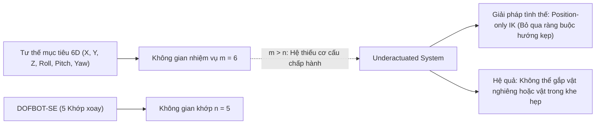
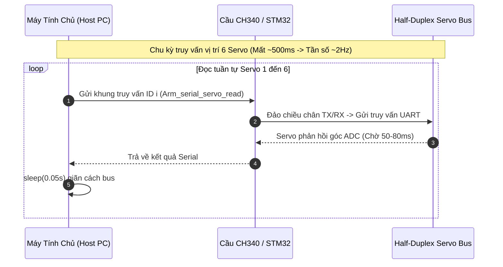

# 08. Các Hạn Chế Kỹ Thuật & Thách Thức Chưa Giải Quyết (Technical Limitations & Open Challenges)

Tài liệu này phân tích chuyên sâu các điểm nghẽn kỹ thuật, hạn chế vật lý, sai số tích lũy cơ điện tử và các vấn đề phần mềm tồn đọng trên hệ thống cánh tay robot **Yahboom DOFBOT-SE**. Mục tiêu của tài liệu là cung cấp luận cứ khoa học và giải thích nguyên nhân gốc rễ (root-cause analysis) phục vụ phần "Bàn luận" (Discussion) và "Hạn chế & Hướng phát triển" (Limitations & Future Work) trong bài báo nghiên cứu.

---

## 1. Bảng Tổng Hợp Các Hạn Chế Cốt Tử (Limitation Matrix)

| STT | Tên hạn chế / Hiện tượng | Phân loại | Mức độ ảnh hưởng | Nguyên nhân kỹ thuật gốc rễ (Root Cause) |
| :---: | :--- | :---: | :---: | :--- |
| **1** | **Thiếu bậc tự do định hướng (5-DOF Underactuation)** | Cơ học / Động học | Rất cao | Không thể đạt tư thế 6D tùy ý; kẹt Gimbal Lock khi chúc vuông góc xuống bàn. |
| **2** | **Độ rơ cơ khí & Sai số hồi vị tích lũy (Backlash)** | Cơ điện tử | Cao | Hộp số kim loại giá rẻ có rơ $\le 1^\circ$; sai số tích lũy ở đầu kẹp từ $3 - 8\text{ mm}$. |
| **3** | **Tần số lấy mẫu phản hồi cực thấp ($\sim 2\text{ Hz}$)** | Truyền thông nhúng | Rất cao | Bus UART bán song công truy vấn tuần tự 6 servo mất $500\text{ ms}$; không thể chạy điều khiển vòng kín. |
| **4** | **Không có cảm biến phản hồi lực kẹp (Open-Loop Gripper)** | Cơ cấu chấp hành | Cao | Kẹp vật cứng gây kẹt dòng cực đại ($2.4\text{ A}$), sụt áp hoặc cháy cuộn dây servo. |
| **5** | **Võng cánh tay do trọng trường (Gravity Deflection)** | Cơ cấu cơ khí | Trung bình | Biến dạng đàn hồi của khớp và khung nhôm khi vươn xa làm TCP võng hạ $5 - 10\text{ mm}$. |
| **6** | **Rung lắc quán tính camera Eye-in-Hand** | Thị giác máy tính | Trung bình | Camera gắn trên khâu 4 bị rung dao động $0.3 - 0.6\text{ s}$ sau mỗi điểm dừng quỹ đạo. |
| **7** | **Sụt áp đường nguồn chung (Power Rail Brownout)** | Điện / Nguồn | Cao | Không cách ly nguồn logic MCU và nguồn động lực servo; dòng khởi động làm reset STM32. |
| **8** | **Race-condition đệm nối tiếp khi mở cổng (FIFO Race)** | Driver phần mềm | Trung bình | Byte rác tồn đọng trên chip CH340 làm hỏng khung truyền đầu tiên sau khi kết nối. |

---

## 2. Phân Tích Chuyên Sâu Từng Vấn Đề Kỹ Thuật

### 2.1. Hạn Chế Bậc Tự Do Cơ Học (5-DOF Kinematic Underactuation & Singularity)

* **Bản chất toán học:** Cánh tay robot DOFBOT-SE chỉ có $5$ khớp quay nối tiếp ($n = 5$), trong khi không gian thao tác Đề-các đầy đủ đòi hỏi $6$ bậc tự do ($m = 6$ gồm 3 bậc vị trí và 3 bậc hướng). Ma trận Jacobi $J(q) \in \mathbb{R}^{6 \times 5}$ luôn có hạng tối đa là $5$ ($\text{rank}(J) \le 5$), dẫn đến hệ phương trình vi phân vận tốc $\dot{x} = J(q) \dot{q}$ không thể có nghiệm giải tích tổng quát cho vector vận tốc không gian bất kỳ.
* **Điểm kỳ dị Gimbal Lock khi kẹp chúc đứng:**
  Khớp 1 xoay quanh trục $Z$ của đế, trong khi khớp 5 xoay quanh trục $Z$ cục bộ của cổ tay. Khi cánh tay hạ chúc thẳng đứng vuông góc với mặt phẳng bàn ($\text{Pitch} = -90^\circ$ hoặc Yaw $= -\pi$), trục xoay của Khớp 1 và Khớp 5 trở nên **trùng phương hoàn toàn**. Ma trận Jacobi bị suy biến (mất 1 bậc tự do độc lập). Nếu sử dụng các bộ giải IK Newton-Raphson tiêu chuẩn, ma trận $J J^T$ trở nên gần kỳ dị ($\det(J J^T) \to 0$), gây ra hiện tượng bùng nổ vận tốc tính toán và khóa cứng các khớp ở biên giới hạn.
* **Hệ quả thực tế:** Robot không thể thực hiện thao tác gắp các vật thể nằm nghiêng phức tạp hoặc luồn lách vào các không gian bị che chắn hướng bên hông; hệ thống bắt buộc phải chấp nhận giải pháp tình thế là thả lỏng ràng buộc hướng (`position_only_ik: true`).

---

### 2.2. Sai Số Tích Lũy Cơ Khí & Độ Rơ Bánh Răng Hộp Số (Backlash & Return Error)

* **Hiện tượng:** Khi cánh tay di chuyển từ hai hướng tiếp cận khác nhau tới cùng một tọa độ góc servo trên phần mềm (ví dụ $q_i = 90^\circ$), vị trí thực tế của đầu kẹp trong không gian có thể sai lệch từ $3.0\text{ mm}$ đến $8.0\text{ mm}$.
* **Nguyên nhân kỹ thuật:**
  Động cơ servo DS-SY15A sử dụng bộ giảm tốc bánh răng kim loại với tỉ số truyền cao ($1:373$). Theo bảng đặc tính kỹ thuật từ nhà sản xuất, mỗi servo có:
  * Sai số hồi vị (Return position error): $\delta \theta_{\text{return}} \le 1.0^\circ$ ($0.0175\text{ rad}$).
  * Độ rơ khe hở bánh răng (Backlash): $\delta \theta_{\text{backlash}} \le 1.0^\circ$ ($0.0175\text{ rad}$).
* **Cơ chế lan truyền sai số qua chuỗi động học:**
  Độ lệch vị trí tại khâu thao tác cuối do sai số góc tại từng khớp được ước lượng theo công thức:
  $$\Delta r_{\text{tcp}} \le \sum_{i=1}^{5} L_i \cdot \sin(\delta \theta_i)$$
  Với chiều dài cánh tay trên $L_2 = 82.85\text{ mm}$, cẳng tay $L_3 = 82.85\text{ mm}$, cổ tay $L_4 = 78.15\text{ mm}$ và kẹp $L_5 = 68.09\text{ mm}$:
  $$\Delta r_{\text{tcp}} \approx (82.85 + 82.85 + 78.15 + 68.09) \cdot \sin(1.0^\circ) \approx 312 \cdot 0.01745 \approx \mathbf{5.44\text{ mm}}$$
* **Hậu quả:** Sai số này vượt quá dung sai tiếp cận khi gắp các vật thể nhỏ (ví dụ quân cờ có bán kính đáy chỉ $10\text{ mm}$), dễ làm đầu mỏ kẹp va quẹt vào cạnh quân cờ và gây đổ vật cản xung quanh.

---

### 2.3. Tắc Nghẽn Giao Tiếp Bus Nối Tiếp & Tần Số Lấy Mẫu Cực Thấp (Serial Latency)

* **Nguyên lý tắc nghẽn:** Giao tiếp giữa bo điều khiển STM32 và 6 động cơ servo sử dụng chung một đường truyền bus UART bán song công (Half-Duplex Single Wire) ở tốc độ $115200\text{ bps}$. Do chia sẻ chung một dây dẫn vật lý, các thiết bị phải giao tiếp theo phương thức hỏi-đáp tuần tự (Master-Slave Polling).
* **Định lượng độ trễ:**
  * Mỗi lệnh đọc vị trí một servo đòi hỏi gửi khung truy vấn $6\text{ bytes}$, chờ servo xử lý nội bộ, chuyển mạch chiều thu phát và nhận lại khung phản hồi $8\text{ bytes}$. Thời gian tiêu tốn cho một servo dao động từ $50\text{ ms}$ đến $80\text{ ms}$.
  * Để đọc đủ trạng thái của 6 servo, hệ thống tiêu tốn:
    $$T_{\text{cycle}} = 6 \times (50\text{ ms} \dots 80\text{ ms}) \approx 300\text{ ms} \dots 500\text{ ms} \implies f_{\text{sample}} \approx 2.0\text{ Hz}$$
* **Hậu quả điều khiển:**
  Tần số lấy mẫu $2\text{ Hz}$ là **hoàn toàn bất khả thi đối với các thuật toán điều khiển phản hồi vòng kín hiện đại** (thường yêu cầu tần số tối thiểu $50 - 100\text{ Hz}$ như ROS 2 Control / Joint Trajectory Controller). Nếu robot gặp vật cản hoặc bị người chạm vào trên đường đi, hệ thống mất tới $0.5\text{ giây}$ mới phát hiện được sai số bám quỹ đạo, thời gian này đủ dài để làm hỏng nhông truyền động hoặc gây nguy hiểm cho người vận hành.

---

### 2.4. Thiếu Cảm Biến Lực Kẹp & Nguy Cơ Quá Dòng Cháy Động Cơ (Open-Loop Gripping)

* **Thiết kế cơ cấu:** Cơ cấu kẹp song song được dẫn động bởi 1 động cơ servo DS-SY15A thông qua thanh truyền. Mỏ kẹp không được trang bị bất kỳ cảm biến áp giác, cảm biến lực căng (strain gauge) hay công tắc hành trình nào.
* **Nguyên lý điều khiển hiện tại:** Lệnh đóng kẹp được gửi theo góc cố định:
  $$\theta_{\text{grip}} = 135^\circ \dots 180^\circ$$
* **Nguy cơ phá hủy phần cứng:**
  * Khi kẹp một vật thể cứng có kích thước thực tế lớn hơn khẩu độ ứng với góc lệnh, hai mỏ kẹp bị vật cản chặn lại giữa chừng trong khi chiết áp nội bộ của servo chưa đạt tới góc đích.
  * Mạch điều khiển PID bên trong servo sẽ liên tục bơm dòng điện cực đại để cố gắng đưa góc hồi tiếp về góc đặt, đẩy động cơ rơi vào trạng thái ngắn mạch kẹt (Stall condition).
  * Theo datasheet, dòng kẹt lên tới **$I_{\text{stall}} \le 2.4\text{ A}$**. Nếu duy trì trạng thái này quá $5 - 10\text{ giây}$, cuộn dây phần ứng của động cơ sẽ bị quá nhiệt dẫn đến cháy động cơ hoặc làm biến dạng vỏ nhựa PA+30GF của servo.

---

### 2.5. Hiện Tượng Biến Dạng Đàn Hồi & Võng Cánh Tay Do Trọng Lực (Elastic Deflection)

* **Hiện tượng:** Khi cánh tay vươn dài ra phía trước ở tầm với cực đại ($X \approx -0.25\text{ m}$ đến $-0.30\text{ m}$), độ cao thực tế của đầu kẹp luôn thấp hơn từ $5.0\text{ mm}$ đến $10.0\text{ mm}$ so với độ cao tính toán lý thuyết từ mô hình URDF cứng.
* **Nguyên nhân:**
  * Toàn bộ cấu trúc thân tay máy được gia công từ các tấm nhôm dập mỏng ($1.5 - 2.0\text{ mm}$) nối với nhau qua các tai bắt ốc servo.
  * Các trục đầu ra của servo sử dụng ổ trượt và vòng bi nhỏ, có độ đàn hồi cơ học nhất định dưới tác dụng của mô-men uốn do tải trọng bản thân ($\approx 1.25\text{ kg}$) và trọng lượng của camera/kẹp tạo ra ở đầu cần:
    $$\tau_{\text{gravity}} = \sum m_i g \cdot r_i \approx 1.5\text{ N}\cdot\text{m}$$
* **Hậu quả:** Khi robot thực hiện quỹ đạo hạ tiếp cận vật thể theo phương ngang ở tầm xa, mỏ kẹp thường xuyên bị cạ quẹt hoặc quét lê trên mặt bàn, gây trầy xước thảm làm việc và làm xô lệch các vật thể cần gắp.

---

### 2.6. Quán Tính Động Học & Rung Dao Động Của Camera Gắn Trên Tay (Eye-in-Hand Blur)

* **Hiện tượng:** Khi cánh tay chuyển động từ tư thế này sang tư thế khác và dừng lại, hình ảnh thu được từ camera bị nhòe mờ trong khoảng $0.3 - 0.6\text{ giây}$ đầu tiên sau khi dừng.
* **Nguyên nhân:** Camera được gắn trên khâu `arm4_Link` bằng giá đỡ nhựa. Do hiện tượng dừng đột ngột của các động cơ servo không có bộ giảm chấn gia tốc mềm mượt, lực quán tính kích thích các dao động cơ học bậc hai tắt dần tại đầu cần.
* **Giải pháp tình thế & Nhược điểm:** Các thuật toán thị giác buộc phải chèn lệnh chờ trễ cứng (`time.sleep(0.5)`) để chờ cánh tay ổn định cơ khí trước khi thu nhận frame ảnh. Điều này làm tăng thời gian chu kỳ tổng thể của mỗi tác vụ gắp thả thêm $15 - 20\%$.

---

### 2.7. Bất Cập Về Thiết Kế Mạch Nguồn Điện (Power Rail Dip & Brownout Reset)

* **Sơ đồ cấp nguồn thực tế:** Bo mạch mở rộng DOFBOT sử dụng chung một nguồn điện đầu vào DC 7.4V/12V để cấp cho cả hai tải:
  1. Tải động lực: Cấp trực tiếp cho các cuộn dây của 6 động cơ servo DS-SY15A.
  2. Tải logic: Đưa qua IC hạ áp (Buck converter) chuyển đổi xuống 5V và 3.3V cấp cho vi điều khiển STM32 và chip nạp CH340.
* **Nguyên nhân sụt áp:** Khi cánh tay kích hoạt chuyển động đồng thời cả 5 khớp từ trạng thái nghỉ, dòng điện tức thời vọt lên đột biến ($I_{\text{surge}} > 5.0\text{ A}$), vượt quá khả năng đáp ứng tức thời của bộ đổi nguồn. Sự sụt áp trên đường nguồn chính kéo theo sụt áp trên đường 3.3V logic.
* **Hậu quả:**
  * Vi điều khiển STM32 bị kích hoạt mạch bảo vệ điện áp thấp (Brownout Reset - BOR), tự động khởi động lại giữa chừng làm mất toàn bộ trạng thái điều khiển.
  * Chip cầu nối USB CH340 bị reset làm đứt kết nối serial với máy tính chủ, sinh ra lỗi `SerialException: device disconnected` trên hệ điều hành Ubuntu.
