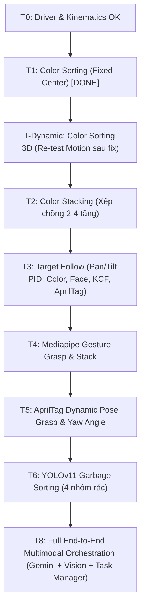
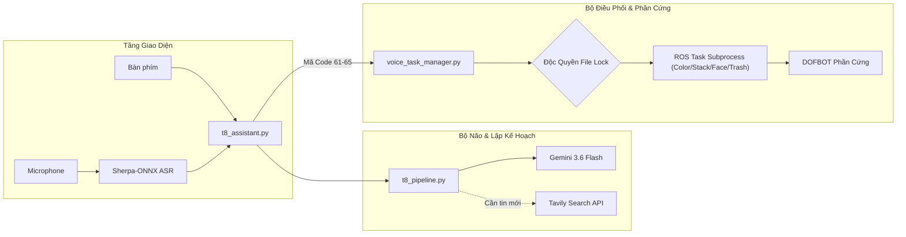

# Tổng Hợp Dự Án DOFBOT-SE: Kiến Trúc Gốc, Phân Tích Kỹ Thuật & Quá Trình Tái Cấu Trúc (Refactor)

Tài liệu này tổng hợp toàn bộ các dự án/tác vụ đã thực hiện và lộ trình sắp tới trên cánh tay robot **Yahboom DOFBOT-SE (5-DOF + Gripper)**, phân tích chi tiết cấu tạo, input/output và cơ chế hoạt động của các file gốc Yahboom, đồng thời giải trình lý do tại sao code gốc quá thô sơ/nguy hiểm và cách chúng ta đã tái thiết kế (refactor) để đưa vào ứng dụng thực tế an toàn, chuẩn xác.

---

## I. Tổng Hợp Các Dự Án: Đã Làm vs Sẽ Làm (Past & Roadmap)

Dựa trên các log kỹ thuật (`2026-09-23_IK-rebuild.md`, `2026-09-23_T1_color-sorting.md`, `2026-09-23_T-dynamic-sorting.md`, `2026-09-24_T7_voice-bringup.md`, `2026-09-24_T8_L1-L2_llm-bringup.md`) và tài liệu kế hoạch kiểm thử tổng thể (`yahboom_task_test_plan.md`):

### 1. Các dự án / Tác vụ ĐÃ HOÀN THÀNH & TÁI CẤU TRÚC (Completed & Refactored)

| STT | Phân hệ / Task | Tình trạng | Những gì đã đạt được & Ý nghĩa kỹ thuật |
| :--- | :--- | :---: | :--- |
| **1** | **Infra: Kinematics Rebuild (KDL)** | **PASS** | Tái xây dựng hoàn toàn lõi tính toán FK/IK bằng **Orocos-KDL** mã nguồn mở (`dofbot_kinematics.cpp`). Loại bỏ hoàn toàn sự phụ thuộc vào 2 thư viện nhị phân đóng nguồn (`libkin_srv.so`, `libdofbot_kinematics.so`) vốn chỉ chạy được trên image Ubuntu của Yahboom. Tích hợp giải thuật **Multi-seed Newton-Raphson** (13 seeds) kết hợp **Fallback Random-Restart** (200x40) giúp triệt tiêu điểm kỳ dị (singularity) và kẹt giới hạn khớp (joint limits). |
| **2** | **T0: Hardware Prereq & Bring-up** | **PASS** | Xác định cổng thiết bị chuẩn trên môi trường thực tế (`/dev/ttyUSB0` cho controller STM32/CH340; phân tách camera robot Sonix `/dev/video0` hoặc `/dev/video2` khỏi webcam tích hợp của laptop ACER). Khắc phục hiện tượng race-condition đọc cổng COM lần đầu (bỏ qua frame rác đầu tiên để chẩn đoán chính xác 6 servo còn sống). |
| **3** | **T1: Color Sorting Fixed-Center** | **PASS** | Hoàn thành pipeline nhận diện màu (Đỏ, Xanh lá, Xanh dương, Vàng) qua HSV ROI cố định và thực thi chuỗi hành vi gắp thả theo các tư thế định sẵn (`P_LOOK_MAP`, `P_BLACK_CENTER`, 4 khay màu). |
| **4** | **T-Dynamic: Grasp Tọa độ Động** | **PARTIAL**<br>*(Đã fix lỗi gốc)* | Phân tích và sửa chữa toàn bộ 3 lỗi cốt tử làm robot bị vặn vẹo khớp (J4 xoay $180^\circ$ đập bàn): **Double inversion** trong tính góc servo, **Nghịch đảo trục X** giữa không gian ảnh và URDF, và **Lỗi xung đột NumPy 2.x / OpenCV**. Tạo node trung gian `cam_pub.py` pack raw RGB8 sang ROS Image, loại bỏ hoàn toàn `cv_bridge` bị lỗi thời. |
| **5** | **T7: Voice Bring-up & Shim Layer** | **PASS** | Tái tạo module shim `Speech_Lib.py` và `smbus.py` cho phép giả lập/tiêm mã giọng nói (`SPEECH_MOCK_SEQ`, `/tmp/speech_mock_code`) để kiểm thử offline an toàn mà không cần phần cứng micro I2C. Sửa chữa 21 file script gốc bị hardcode đường dẫn tuyệt đối `/home/yahboom` và thiết bị `/dev/myserial`. |
| **6** | **T8: LLM Bring-up & Architecture Modernization** | **PASS** | Dọn sạch cache và build thành công các package ROS 2 `interfaces`, `text_chat`. Tạo `stub_planner.py` kiểm thử whitelist JSON action. Đặc biệt: **Thay thế toàn bộ stack cũ cồng kềnh (Dify/OpenAI + action_service 2700 dòng có lỗi vung tay bừa bãi)** bằng kiến trúc hiện đại `t8_assistant.py` + `t8_pipeline.py` (Gemini API `gemini-3.6-flash`, Tavily web search, Sherpa-ONNX ASR offline, Edge TTS) kết hợp bộ điều phối độc quyền tác vụ `voice_task_manager.py`. |

---

### 2. Các dự án / Tác vụ SẼ LÀM (Roadmap & Next Steps)

Lộ trình tiếp theo tuân theo nguyên tắc: **Perception (Vision-only) $\rightarrow$ Dry-run Motion (Không tải) $\rightarrow$ Thực nghiệm gắp thả $\rightarrow$ Tích hợp đa phương thức (Voice/LLM)**.



1. **Re-test Motion cho T-Dynamic Sorting**:
   - Thử nghiệm lại việc gắp vật tại tọa độ tự do sau khi đã nạp bản vá sửa dấu $-X$, bỏ double inversion và multi-seed IK.
2. **T2: Color Grab & Stacking (Xếp chồng khối màu)**:
   - Gắp các khối màu và xếp chồng lên nhau thành tháp (2 đến 4 tầng).
   - *Yêu cầu cốt lõi*: Kiểm soát biến đếm tầng, tính toán bù trừ độ cao trục Z (mỗi tầng tăng $\Delta Z \approx 3\text{ cm}$) để tránh va quẹt khối bên dưới khi nhả kẹp.
3. **T3: Target Follow (Theo dõi mục tiêu 2D Pan/Tilt)**:
   - Sử dụng 2 servo (Servo 1: quay đế Pan, Servo 4/5: chúc ngẩng Tilt) kết hợp bộ điều khiển PID bám theo tâm đối tượng trong ảnh (`color_follow`, `face_follow`, `KCF_follow`, `apriltag_follow`).
4. **T4: Gesture Grasp & Stacking (Điều khiển bằng cử chỉ tay)**:
   - Tích hợp Google MediaPipe Hands trích xuất 21 tọa độ bàn tay, phân loại cử chỉ (Nắm tay, Chữ V, Đếm ngón...) để ra lệnh cho cánh tay mô phỏng hành vi hoặc gắp/xếp khối.
5. **T5: AprilTag / ArUco Sorting & Dynamic Orientation**:
   - Nhận diện mã Tag ID, tính ma trận xoay góc Yaw của vật thể trên bàn thông qua 4 góc đỉnh của tag, điều chỉnh khớp Joint 5 (xoay cổ tay) sao cho kẹp song song với cạnh của khối trước khi gắp.
6. **T6: Garbage Classification với YOLOv11**:
   - Chạy mô hình YOLOv11 (`best.pt` / `best.onnx`) phân loại các loại rác thải thành 4 nhóm (Tái chế, Nguy hại, Nhà bếp, Khác) và điều khiển cánh tay thả vào đúng thùng rác tương ứng.
7. **T8: Mở rộng khả năng VLM (Vision-Language Model) với Gemini**:
   - Kích hoạt tính năng `--see` / `/see` trên `t8_assistant.py`: truyền frame trực tiếp từ robot camera vào Gemini để hiểu ngữ cảnh phức tạp ("Hãy gắp khối nằm bên trái hộp giấy", "Đọc chữ trên nhãn dán").

---

## II. Phân Tích Code Gốc Của Yahboom: Thô Sơ, Bất Cập & Nguy Cơ Thực Tế

Bản mã nguồn gốc do hãng cung cấp chỉ mang tính chất minh họa đồ chơi trong môi trường đóng kín (phục vụ image Ubuntu được cấu hình sẵn trên máy ảo/board của họ). Khi đưa vào dự án thực tế độc lập, code bộc lộ các sai sót kỹ thuật và nguy cơ nghiêm trọng sau:

### 1. Phụ thuộc tuyệt đối vào hệ thống đóng kín (Environment Lock-in)
- **Closed-source Blobs**: Các gói ROS 2 tính toán động học như `dofbot_info` không đi kèm mã nguồn C++ mà chỉ liên kết cứng tới 2 thư viện chia sẻ `/usr/lib/libkin_srv.so` và `/usr/lib/libdofbot_kinematics.so`. Khi đưa lên hệ điều hành sạch hoặc máy tính người dùng, hệ thống hoàn toàn không thể build hay chạy được node IK.
- **Hardcoded Absolute Paths**: Rải rác khắp hàng chục script là các đường dẫn tĩnh tuyệt đối tới thư mục của kỹ sư Yahboom: `/home/yahboom/...` (từ file mô hình `best.pt`, file URDF robot, cho đến các bản ghi âm `boot.mp3`, `speech_music`).
- **Hardcoded Device Interfaces**: Code mặc định cổng serial là `/dev/myserial` (một symlink udev yêu cầu quyền root tạo ra) và camera index mặc định là `0`. Trên laptop có webcam tích hợp, `0` luôn là webcam hướng vào mặt người dùng thay vì camera robot, dẫn đến việc chương trình nhận diện nhầm hoặc chiếm dụng sai thiết bị.

### 2. Nguy cơ an toàn phần cứng nghiêm trọng (Severe Safety Hazards)
- **Vung cánh tay ngay khi import module**: Trong file `LargeModel_ws/src/largemodel/largemodel/action_service.py`, các lệnh điều khiển servo vật lý được đặt ngay ở **phạm vi toàn cục (module top-level scope)**:
  ```python
  import Arm_Lib
  Arm = Arm_Lib.Arm_Device()
  os.system('sudo v4l2-ctl -d /dev/video0 -c brightness=10')
  # Lệnh vật lý nguy hiểm chạy ngay khi import:
  Arm.Arm_serial_servo_write6(90, 120, 0, 0, 90, 30, 1000)
  ```
  Chỉ cần một tiến trình khác vô tình import `action_service` hoặc ROS launch quét node, cánh tay lập tức kích hoạt động cơ và vung hết tốc lực tới vị trí mới mà không hề có bất kỳ cơ chế kiểm tra an toàn, nút dừng khẩn cấp hay kiểm tra giới hạn không gian nào.
- **Lệnh sudo làm treo tiến trình**: Việc chèn `sudo v4l2-ctl` khiến chương trình bị treo chờ password sudo ở background, gây crash hoặc deadlock toàn bộ hệ thống ROS.

### 3. Các lỗi toán học và động học cốt tử (Kinematic & Mathematical Flaws)
- **Lỗi Double Inversion (Nghịch đảo góc 2 lần)**:
  Trong `dofbot_sorting_3d/grasp.py`, tác giả viết:
  ```python
  # Code gốc Yahboom:
  joints[1] = 180 - response.joint2
  joints[2] = 180 - response.joint3
  joints[3] = 180 - response.joint4
  self.Arm.Arm_serial_servo_write6(joints[0], joints[1], joints[2], ...)
  ```
  Trong khi đó, ở tầng thư viện giao tiếp phần cứng `Arm_Lib.py`, hàm `Arm_serial_servo_write6()` vốn dĩ đã có dòng code đảo góc bên trong:
  ```python
  # Bên trong Arm_Lib:
  s2 = 180 - s2
  s3 = 180 - s3
  s4 = 180 - s4
  ```
  Hậu quả là góc khớp bị tính toán ngược 2 lần ($180 - (180 - \theta) = \theta$), khiến khớp 2, 3, 4 nhận góc đối xứng gương qua mặt phẳng thẳng đứng. Khi thực thi, thay vì chúc xuống bàn để gắp, cánh tay bị bẻ quặt ra sau hoặc đập gãy cấu trúc cơ khí.
- **Hệ tọa độ bị ngược dấu trục X (Frame Inversion)**:
  Công thức ánh xạ pixel ra không gian thực của Yahboom tính ra giá trị $X$ mang dấu dương ($+X$). Tuy nhiên, trong mô hình URDF chuẩn của DOFBOT, toàn bộ vùng làm việc của bàn gắp trước mặt robot lại nằm ở **nửa mặt phẳng âm ($-X$)** (được kiểm chứng qua FK của pose `P_BLACK_CENTER` là $X = -0.207\text{ m}$). Khi ép solver IK tìm nghiệm ở vùng $+X$, solver buộc phải xoắn ngược khớp J4 tới giới hạn cực đại ($180^\circ$) để cố với ra sau.
- **Bộ giải IK đơn điểm bị kẹt (Local Singularity & Gimbal Lock)**:
  Thuật toán IK gốc của Yahboom sử dụng Newton-Raphson với một vector khởi tạo duy nhất (single initial guess). Với cánh tay 5-DOF (thiếu 1 bậc tự do định hướng hoàn chỉnh), tư thế gắp thẳng đứng chúc xuống (pitch $\approx -90^\circ$ hoặc Yaw $= -\pi$) rơi đúng vào vùng kỳ dị Gimbal Lock. Solver bị kẹt clamp ở biên và trả về thất bại (hoặc trả về toàn số 0, làm các khớp đập thẳng về $0^\circ$).

### 4. Không tương thích phần mềm hiện đại (Modern Software Stacks)
- Yahboom sử dụng `cv_bridge` biên dịch cho Python cũ / NumPy 1.x. Khi chạy trên các bản phân phối Linux hiện đại với NumPy 2.x, `cv_bridge` lập tức bị crash với mã lỗi `KeyError 16`.
- Gọi hàm OpenCV `cv2.imshow()` từ bên trong luồng phụ (worker thread), vi phạm nguyên lý luồng giao diện của Qt/X11, làm sập toàn bộ ứng dụng.

---

## III. Chi Tiết Từng Phần Gốc: Cấu Tạo, Cách Code & Input/Output

Dưới đây là phân tích chi tiết từng khối module nền tảng trong repo gốc của Yahboom:

```
┌─────────────────────────────────────────────────────────────────────────────────┐
│                           KIẾN TRÚC TỔNG THỂ DOFBOT                             │
├─────────────────────────┬───────────────────────────┬───────────────────────────┤
│    1. PERCEPTION        │       2. DECISION         │       3. ACTUATION        │
│   (Thị giác & Giọng nói)│   (Quy tắc, IK & Planner) │    (Giao tiếp phần cứng)  │
├─────────────────────────┼───────────────────────────┼───────────────────────────┤
│ • Camera (V4L2/RGB8)    │ • Color Logic / ID Table  │ • kinemarics_dofbot (KDL) │
│ • HSV InRange / Contour │ • Tag Rotation (Yaw)      │ • Arm_Lib (Serial CH340)  │
│ • YOLOv11 / MediaPipe   │ • Gemini / Stub Planner   │ • Bus Servo 1..6          │
│ • Speech Shim / ASR     │ • Task Manager Supervisor │ • RGB LED / Buzzer        │
└─────────────────────────┴───────────────────────────┴───────────────────────────┘
```

---

### 1. Phân hệ Kinematics: `kinemarics_dofbot.cpp` & `dofbot_kinematics.h`

* **Mục đích**: Cung cấp service ROS 2 mang tên `dofbot_kinemarics` để giải quyết 2 bài toán cơ bản của tay máy 5 bậc tự do:
  1. **Forward Kinematics (FK)**: Từ 5 góc servo hiện tại, tính ra tọa độ vị trí $(X, Y, Z)$ và góc hướng (Roll, Pitch, Yaw) của điểm kẹp (`Gripping_point_Link`).
  2. **Inverse Kinematics (IK)**: Từ tọa độ đích $(X, Y, Z)$ và góc hướng mong muốn, giải ra 5 góc servo cần thiết để đưa tay máy tới vị trí đó.

* **Input & Output**:
  * **FK Input**: `cur_joint1..cur_joint5` (độ, dải $0^\circ \dots 180^\circ$).
  * **FK Output**: `x, y, z` (mét), `roll, pitch, yaw` (radian).
  * **IK Input**: `tar_x, tar_y, tar_z` (mét), `roll, pitch, yaw` (radian).
  * **IK Output**: `joint1..joint5` (độ, dải $0^\circ \dots 180^\circ$).

* **Cấu tạo & Cơ chế hoạt động**:
  * Đọc mô tả hình học robot từ file URDF (`dofbot.urdf`).
  * **Quy ước khớp**: Khớp URDF lấy $0\text{ rad}$ tại vị trí giữa, tương đương $90^\circ$ của servo phần cứng. Do đó, công thức biến đổi là:
    $$q_{\text{KDL}} = (\theta_{\text{servo}} - 90^\circ) \times \frac{\pi}{180}$$
  * Chuỗi động học nối từ link gốc `base_link` qua 5 khớp xoay `arm_joint1` $\dots$ `arm_joint5` đến điểm thao tác cuối `Gripping_point_Link`.
  * *Hạn chế của bản gốc*: Sử dụng thư viện nhị phân tĩnh đóng kín, solver đơn giản dễ tắc nghẽn, trả về mã lỗi im lặng hoặc vector 0 khi không tìm thấy nghiệm.

---

### 2. Phân hệ Phân Loại Màu Cố Định: `color_sorting.py` & `robot_controller.py`

* **Mục đích**: Tác vụ T1 - Nhận diện khối màu nằm tại điểm cố định trên bàn và gắp bỏ vào 4 khay màu tương ứng.

* **Input & Output**:
  * **Input**: Luồng khung hình video từ camera (`/dev/video0`), kích thước $640 \times 480$.
  * **Output**: Chuỗi byte nhị phân điều khiển 6 servo truyền qua cổng serial USB CH340 (`/dev/ttyUSB0`), tốc độ baud 115200.

* **Cấu tạo & Luồng xử lý chi tiết**:
  ```mermaid
  sequenceDiagram
      autonumber
      participant C as Camera
      participant V as color_sorting.py
      participant R as robot_controller.py
      participant A as Arm_Lib (Serial)

      Note over V: Cắt ROI [200:480, 160:400]
      C->>V: Frame ảnh thô (BGR)
      V->>V: BGR -> HSV -> InRange Mask
      V->>V: Morphology Close + Find Contours
      V->>V: Lọc contour area > 1000 & Debounce 10 frames
      V->>R: Kích hoạt sorting_run(color_name)
      R->>A: P_LOOK_MAP (Nâng đầu quan sát)
      R->>A: Mở kẹp (Góc 30 độ)
      R->>A: P_BLACK_CENTER (Hạ tay xuống tâm gắp cố định)
      R->>A: Đóng kẹp (Góc 135 độ)
      R->>A: Nâng khớp J2, J3 lên cao
      R->>A: Xoay J1 sang góc khay màu (Đỏ: 117°, Xanh lá: 136°, ...)
      R->>A: Mở kẹp thả vật
      R->>A: Quay về P_LOOK_MAP
  ```
  * *Đặc điểm kỹ thuật*: Đây là giải thuật **Open-loop (vòng hở)** hoàn toàn. Vị trí gắp `P_BLACK_CENTER = [90, 35, 65, 15, 90, 30]` và vị trí 4 khay màu được gán cứng (hardcoded joint array). Camera chỉ đóng vai trò phân loại nhãn màu, không can thiệp vào tọa độ gắp. Chương trình dùng lệnh `time.sleep()` để chờ cánh tay di chuyển, không có cảm biến phản hồi lực kẹp.

---

### 3. Phân hệ Phân Loại Tọa Độ Tự Do: `dofbot_sorting_3d` (`color_sorting.py`, `grasp.py`)

* **Mục đích**: Tác vụ T-Dynamic - Nhận diện khối màu đặt tại vị trí bất kỳ trong tầm nhìn của camera trên bàn, chuyển đổi tọa độ pixel sang tọa độ thực và gọi IK để gắp vật chính xác.

* **Input & Output**:
  * **Input Node Perception (`color_sorting.py`)**: Frame ảnh camera $\rightarrow$ Tính toán tâm khối màu $(c_x, c_y)$.
  * **Message Trung Gian**: Topic ROS 2 `PosInfo` chứa `id` (mã màu), `x, y, z` (tọa độ không gian mét).
  * **Output Node Motion (`grasp.py`)**: Lệnh gọi Service `Kinemarics` $\rightarrow$ Nhận 5 góc khớp $\rightarrow$ Gửi lệnh tới `Arm_Device`.

* **Cấu tạo & Luồng toán học**:
  1. *Chuyển đổi từ Pixel sang Không gian (Pixel-to-World mapping)*:
     Yahboom sử dụng công thức hồi quy xấp xỉ bậc một:
     $$a = \frac{320 - c_x}{4000}, \quad b = \left(\frac{480 - c_y}{3000}\right) \times 0.8 + 0.12$$
     Tọa độ mục tiêu gửi đi: $X_{\text{raw}} = b$, $Y_{\text{raw}} = a + 0.01$, $Z_{\text{raw}} = 0.039\text{ m}$.
  2. *Truy vấn Động học Nghịch (IK Request)*:
     Node `grasp.py` tạo request gửi tới node động học với định hướng kẹp chúc xuống bàn:
     $$\text{Pitch} = 1.04\text{ rad} \approx 60^\circ, \quad \text{Yaw} = -\pi$$
  3. *Thực thi di chuyển*:
     Mở kẹp $\rightarrow$ Gửi đồng thời 5 góc khớp tính từ IK $\rightarrow$ Chờ 2 giây $\rightarrow$ Đóng kẹp $\rightarrow$ Nâng tay $\rightarrow$ Đưa sang vị trí khay tương ứng với ID màu $\rightarrow$ Nhả kẹp.

---

### 4. Phân hệ Nhận Dạng Giọng Nói: `dofbot_voice` (`simple_voice_ctrl.py`, `Speech_Lib.py`)

* **Mục đích**: Tác vụ T7 - Tiếp nhận các lệnh thoại từ bo mạch nhận diện giọng nói ngoại vi (kết nối qua I2C hoặc Serial) để điều khiển trực tiếp robot hoặc kích hoạt các chuỗi tác vụ phức tạp.

* **Input & Output**:
  * **Input**: Mã lệnh số nguyên (Integer Command Code, ví dụ: 11: Đỏ, 12: Xanh lá, 38: Còi Buzzer, 39: Tư thế đứng, 61: Phân loại màu...).
  * **Output**: Đổi màu LED RGB trên bo mạch, kêu còi Buzzer, xoay servo theo góc định sẵn hoặc gọi hàm phát thanh âm thanh phản hồi qua loa `void_write(code)`.

* **Cấu tạo & Cách thức vận hành**:
  * Vòng lặp chính liên tục thăm dò cổng phần cứng: `code = mySpeech.speech_read()`.
  * So khớp `code` với bảng tra cứu quy tắc trong `speech_ID.csv`.
  * *Hạn chế của bản gốc*: Thiếu hoàn toàn module `Speech_Lib` trong mã nguồn phân phối (dẫn tới lỗi không thể import), các đường dẫn file âm thanh chào mừng `boot.mp3` bị hỏng, và quy tắc điều khiển cứng nhắc dạng `if-elif` phân nhánh, chưa có khả năng xử lý ngôn ngữ tự nhiên mềm dẻo.

---

### 5. Phân hệ Mô Hình Lớn Cũ Của Yahboom: `LargeModel_ws` (`action_service.py`, `model_service.py`)

* **Mục đích**: Tác vụ T8 gốc của Yahboom - Kết nối trợ lý giọng nói với nền tảng Dify / OpenAI / DashScope để phân tích câu lệnh tự nhiên thành danh sách các hành động có sẵn.

* **Input & Output**:
  * **Input**: Câu nói của người dùng thu từ microphone qua node `asr.py` hoặc gõ từ bàn phím qua `text_chat.py`.
  * **Output**: Chuỗi JSON chứa danh sách hành động, được gửi dưới dạng ROS Action `Rot.action` tới `action_service`.

* **Cấu tạo & Cấu trúc mã nguồn**:
  * `promot.py`: Định nghĩa system prompt hướng dẫn LLM chỉ được trả về một đối tượng JSON chứa mảng `action`, ví dụ:
    ```json
    {"action": ["light_on('red')", "arm_dance()", "finishtask()"]}
    ```
  * `action_service.py`: Một node khổng lồ dài hơn 2700 dòng code. Node này tạo Action Server lắng nghe action `Rot`. Khi nhận được danh sách hành động, nó dùng biểu thức chính quy (Regex) để parse tên hàm và tham số:
    * Nhóm I/O cơ bản: Gọi trực tiếp hàm điều khiển LED/Buzzer của `Arm_Lib`.
    * Nhóm tác vụ thị giác/chuyển động phức tạp: Dùng `subprocess.Popen` để khởi tạo các script ROS con nằm trong `largemodel_arm/`.
  * *Tại sao kiến trúc này thất bại*: Code trộn lẫn điều khiển khung xe di động (Mobile base navigation) với tay máy cố định; lưu trữ trực tiếp API key trần trong file cấu hình YAML; cấu trúc monolithic cực kỳ dễ đổ vỡ khi một script con bị crash.

---

## IV. Những Cải Tiến & Tái Thiết Kế (Refactor) Đã Áp Dụng

Để biến tập mã nguồn rời rạc, nguy hiểm thành một hệ thống robot vận hành ổn định, tin cậy và có khả năng mở rộng cao, chúng ta đã tiến hành những thay đổi mang tính cốt lõi sau:

```
┌─────────────────────────────────────────────────────────────────────────────────┐
│                       SO SÁNH: CODE GỐC VS BẢN ĐÃ REFACTOR                      │
├──────────────────────────────┬──────────────────────────────────────────────────┤
│ ĐẶC ĐIỂM BẢN GỐC YAHBOOM     │ KIẾN TRÚC MỚI ĐÃ TÁI THIẾT KẾ                    │
├──────────────────────────────┼──────────────────────────────────────────────────┤
│ • Thư viện IK nhị phân đóng  │ • Viết lại bằng Orocos-KDL mã nguồn mở.          │
│ • Single-seed IK (dễ kẹt)    │ • Multi-seed (13 seeds) + Random Restart (200x40)│
│ • Lỗi đảo góc kép 180 - x    │ • Truyền thẳng góc servo, khớp nối tự nhiên.     │
│ • Nhầm dấu không gian (+X)   │ • Chuẩn hóa về nửa mặt phẳng âm (-X) của URDF.   │
│ • cv_bridge sập với NumPy 2  │ • Viết node cam_pub tự pack raw RGB8 vào Image.  │
│ • Vung tay ngay khi import   │ • Loại bỏ side-effect, khởi tạo tuần tự an toàn. │
│ • Dify cồng kềnh, lộ API key │ • Bounded Gemini 3.6 + Tavily + Sherpa-ONNX.     │
│ • Không quản lý tiến trình   │ • Bộ giám sát voice_task_manager (File lock, IPC)│
└──────────────────────────────┴──────────────────────────────────────────────────┘
```

### 1. Tái cấu trúc hoàn toàn hệ thống Động Học (Kinematics Rebuild)
* **File tạo mới**: `dofbot_ws/src/dofbot_info/src/dofbot_kinematics.cpp`.
* **Kỹ thuật áp dụng**:
  * Sử dụng bộ giải vị trí đệ quy `ChainFkSolverPos_recursive` cho bài toán FK.
  * Sử dụng bộ giải nghịch đảo ràng buộc giới hạn khớp `ChainIkSolverPos_NR_JL` kết hợp ma trận giả nghịch đảo vận tốc `ChainIkSolverVel_pinv`.
  * **Chiến lược Multi-seed Restart**: Cung cấp danh sách 13 điểm khởi tạo khác nhau (tập trung vào các tư thế gập tự nhiên của tay máy hướng về mặt bàn) để giải quyết triệt để hiện tượng kẹt cục bộ khi cổ tay hướng thẳng xuống.
  * **Giải thuật Fallback Position-First Random Restart**: Khi mục tiêu nằm ở biên không gian làm việc mà tư thế hướng bị quá ràng buộc (overconstrained), hệ thống tự động thả lỏng ràng buộc góc hướng, kích hoạt 200 lượt lấy mẫu ngẫu nhiên có hạt giống cố định (`seed=12345`) để tìm cấu hình khớp tối ưu có sai số vị trí $< 3\text{ mm}$.

### 2. Sửa chữa toàn diện lỗi Động Học & Thị Giác trong Grasping
* **Loại bỏ Double Inversion**: Trong file `grasp.py`, xóa bỏ hoàn toàn phép biến đổi `180 - x` ở các khớp J2, J3, J4, cho phép góc giải được từ KDL truyền thẳng vào hàm điều khiển phần cứng của `Arm_Lib`.
* **Hiệu chỉnh dấu hệ tọa độ**: Nghịch đảo trục $X$ đầu vào: `target_x = -(pos_x + X_FORWARD_OFFSET_M)`, đảm bảo mục tiêu luôn nằm trong không gian tự nhiên trước mặt robot.
* **Chuẩn hóa góc Yaw của khâu kẹp**: Đặt `request.yaw = -3.1416` tương thích chính xác với khung tọa độ của `Gripping_point_Link`. Đồng thời tính toán góc mở kẹp Joint 5 linh hoạt dựa trên độ nghiêng thực tế của vật thể:
  $$J_5 = J_1 - \Delta_{\text{yaw}}$$
  (thay vì gán cứng $90^\circ$ làm trượt kẹp như bản gốc).
* **Độc lập hóa Camera Node**: Viết node `cam_pub.py` đọc trực tiếp từ OpenCV V4L2 và đóng gói thẳng vào message ROS `sensor_msgs/msg/Image` định dạng `rgb8`, loại bỏ hoàn toàn `cv_bridge` nhằm triệt tiêu lỗi sập trên NumPy 2.x. Đưa các lệnh gọi `cv2.imshow()` về thread chính của executor.

### 3. Tái thiết lập tầng Nhận Dạng Giọng Nói (Speech Shim)
* **File tạo mới**: `dofbot_voice/scripts/Speech_Lib.py` và `smbus.py`.
* **Tính năng**:
  * Đóng gói lớp giao tiếp phần cứng thông minh: tự động phát hiện cổng `/dev/ttyUSB0` khi `/dev/myserial` không tồn tại.
  * Tích hợp chế độ **MOCK Mode**: cho phép lập trình viên tiêm mã lệnh trực tiếp qua biến môi trường `SPEECH_MOCK_CODE`, chuỗi kịch bản `SPEECH_MOCK_SEQ="11,12,38"`, hoặc qua file cờ `/tmp/speech_mock_code`. Điều này giúp việc kiểm thử logic và tích hợp hệ thống diễn ra trơn tru mà không phụ thuộc vào việc kết nối microphone phần cứng.

### 4. Kiến Trúc LLM Hiện Đại, An Toàn & Độc Lập (T8 Architecture)
Chúng ta đã thay thế kiến trúc cũ bằng hệ thống gồm 3 thành phần liên kết chặt chẽ:



* **`t8_pipeline.py` (Lõi xử lý Gemini Bounded)**:
  * Sử dụng SDK hiện đại `google-genai` với model `gemini-3.6-flash`.
  * Ràng buộc chặt chẽ đầu ra JSON: chỉ cho phép 6 hành động cốt lõi (`none`, `color`, `stack`, `face`, `trash`, `stop`). Nghiêm cấm mô hình tự ý sinh lệnh shell hay góc servo tùy tiện.
  * Tích hợp tìm kiếm thông tin thời gian thực qua **Tavily API**, cho phép trả lời câu hỏi cập nhật mà vẫn đảm bảo tính cô lập với hệ thống điều khiển robot.
  * Giới hạn chi phí mạng: tối đa 2 lần gọi Gemini và 1 lần gọi Tavily trên một lượt tương tác; tắt hoàn toàn cơ chế tự retry ẩn.
* **`voice_task_manager.py` (Bộ giám sát tác vụ độc quyền)**:
  * Hoạt động như một **Process Supervisor** độc lập, quản lý thông qua file khóa `/tmp/dofbot_task_manager.lock`.
  * **Quy tắc độc quyền tài nguyên (Mutual Exclusion)**: Đảm bảo tại một thời điểm chỉ duy nhất 1 tác vụ được phép chiếm dụng cổng camera và cổng serial.
  * Tự động khởi tạo và dọn dẹp toàn bộ nhóm tiến trình ROS (`killpg`), có timeout an toàn 20 giây cho IK service. Ghi nhận tình trạng hoạt động và mã lỗi chi tiết vào `/tmp/dofbot_task_status.json`.

---

## V. Hướng Dẫn Vận Hành & Khuyến Nghị An Toàn Khi Chạy Thực Tế

### 1. Kiểm tra môi trường trước khi cấp nguồn
Trước khi bật công tắc nguồn servo, luôn thực hiện các bước kiểm tra phần mềm sau:
1. **Xác định cổng Camera**:
   Kiểm tra thiết bị video: `ls -l /dev/v4l/by-id/`.
   Xác nhận camera robot Sonix đang nằm ở `/dev/video0` hay `/dev/video2` để truyền cờ thiết bị chính xác.
2. **Kiểm tra tiến trình chiếm dụng**:
   Đảm bảo không có tiến trình cũ đang giữ cổng:
   ```bash
   fuser /dev/ttyUSB0
   fuser /dev/video*
   ```
3. **Quy tắc chẩn đoán góc servo**:
   Do hiện tượng byte tồn đọng trên bộ đệm serial của chip CH340 ngay sau khi mở cổng, **lần đọc góc servo đầu tiên luôn phải được bỏ qua**. Chỉ chấp nhận giá trị từ lượt đọc thứ hai trở đi để tránh chẩn đoán nhầm servo bị hỏng.

### 2. Các lệnh khởi động chuẩn

* **Chạy kiểm thử tác vụ T1 (Color sorting cố định)**:
  ```bash
  cd ~/Desktop/robot-arm
  PYTHONPATH="$PWD/colcon_ws/src/dofbot_utils/src:$PWD/colcon_ws/src/dofbot_color_sorting/scripts" \
  python3 colcon_ws/src/dofbot_color_sorting/scripts/color_sorting.py \
    --camera /dev/video0 --port /dev/ttyUSB0
  ```

* **Chạy Service Động Học KDL (Kinematics)**:
  ```bash
  cd ~/Desktop/robot-arm/dofbot_ws
  export LD_LIBRARY_PATH=$PWD/install/dofbot_info/lib:$PWD/install/dofbot_interface/lib:/opt/ros/humble/lib
  ./install/dofbot_info/lib/dofbot_info/kinemarics_dofbot
  ```

* **Chạy Trợ Lý T8 (Gemini + Task Manager)**:
  ```bash
  cd ~/Desktop/robot-arm
  source .venv/bin/activate
  source /opt/ros/humble/setup.bash
  python LargeModel_ws/t8_assistant.py --with-manager
  ```
  *(Thêm `--voice` để bật micro thu âm ngoại tuyến qua Sherpa-ONNX, hoặc thêm `--speak` để phát giọng nói phản hồi qua Edge-TTS).*

---
*Tài liệu được biên soạn và chuẩn hóa phục vụ công tác nghiên cứu, phát triển và bảo trì hệ thống DOFBOT-SE.*
