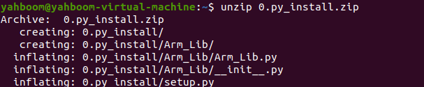
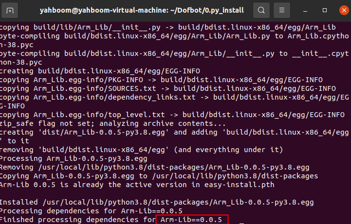
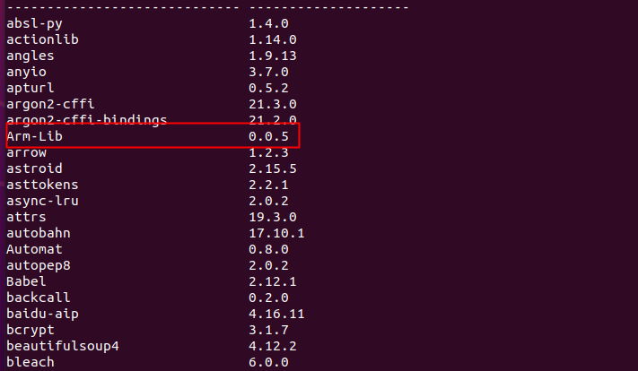
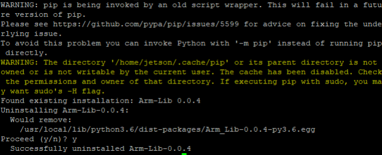

# 					Install Python module

This tutorial is to install the Python driver library of the robotic arm into the virtual machine system.

If you use the virtual machine file provided by Yahboom, the Arm_Lib module is already installed in it and there is no need to install it again.

## 1. Transfer files

Copy the py_install.zip file in the current folder to your virtual machine user directory, and enter the command to decompress it.

```
unzip 0.py_install.tar.gz 
```

After successful decompression, the system will display the following interface.



## 2. Install python library

2.1 Enter the 0.py_install directory.

Note: If the transmission path is different, please use the actual path to execute. There is an Arm_Lib folder and a setup.py file under this path.

```
cd 0.py_install/ 
```

2.2 Enter the following command to install the python library, enter the password and press【Enter】key to confirm.

The system will prompt that the installation is complete and display the version number.

```
sudo python3 setup.py install 
```



2.3 Input the following command to view the module list of pip3.

```
pip3 list
```



## 3. How to uninstall Arm_Lib library

This step only occurs when Arm_Lib is no longer used.

When prompted whether to delete, enter [Y] and press [Enter] to confirm the uninstall.

```
sudo pip3 uninstall Arm_Lib
```



##  4. Arm_Lib library API

- **Arm_serial_servo_write(self, id, angle, time)**

\# Control action group operation. 0: Stop  1: Single run 2: Run in loop

- **Arm_Action_Study(self)**

  \# Record the current action once in study mode

- **Arm_Button_Mode(self, mode)**

​       #Set the mode of K1 button, 0: default mode 1: study mode

- **Arm_Buzzer_Off(self)**

  \# Close buzzer

- **Arm_Buzzer_On(self, delay=255)**

  \# Open the buzzer, delay defaults to 0xff, which control buzzer keeps beeping.

  \# delay=1~50. The buzzer turns off automatically after 100 milliseconds, and the maximum delay time is 5 seconds.

- **Arm_Clear_Action(self)**

​         #Clear action

- **Arm_PWM_servo_write(self, id, angle)**

  \# Control PWM servo. 

  id:1-6 (0 means control all servos). angle: 0-180

- Arm_Product_Select(self, index)

  \# Set the current product color 1~6, and the RGB light will turn on corresponding color.

- **Arm_RGB_set(self, red, green, blue)**

  \# Control RGB light color

-  **Arm_Read_Action_Num(self)**

​		\# Read the number of saved action groups 0

-  **Arm_get_hardversion(self)**

  \# Read the hardware version number

- **Arm_ping_servo(self, id)**

  \# Read the servo status.

  In normally, it will return 0xda; If it didn’t read date, it will return 0x00; other values means servo errors.

- **Arm_reset(self)**

  #Restart drive board

- **Arm_serial_servo_read(self, id)**

  \#Read the specified servo angle

   id: 1-6 returns 0-180. When read error, it will return None

- **Arm_serial_servo_read_any(self, id)**

  \# Read bus servo angle

  id: 1-250

  Return value: 0-180

- **Arm_serial_servo_write(self, id, angle, time)**

  \# Control bus servo

  id: 1-6 (0 is to send 6 servos) 

  angle: 0-180°

  time: servo rotation time

- **Arm_serial_servo_write6(self, s1, s2, s3, s4, s5, s6, time)**

  \# Control 6 bus servos at the same time

  S1~S5 angle:0-180°

  S6 angle:0-270°

  time: servo rotation time

- **Arm_serial_servo_write6_array(self, joints, time)**

  \# joints: an array, which stores the angle data of 6 servos

  time: servo rotation time

- **Arm_serial_servo_write_any(self, id, angle, time)**

​       \# Control any bus servo

​       id: 1-250 (0 is broadcast) 

​       angle: 0-180°

​       time: servo rotation time

- **Arm_serial_servo_write_offset_state(self)**

  \# Read the status of the position offset of the set bus servo,

  0 means no corresponding servo ID, 1 means success, 2 means set failure or it is out of range.

- **Arm_serial_servo_write_offset_switch(self, id)**

  \#  Set the bus servo mid-position offset.

  id: 1-6 servo

  0: Restore the factory default median

- **Arm_serial_set_id(self, id)**

  \# Set the number of the bus servo on expansion board

- **Arm_serial_set_torque(self, onoff)**

  # Control torque of all servo

  1: Turn on the torque 

  0: Turn off the torque (we can manually change the angle of the servo)

  


